## OSI Layer3 Network Layer

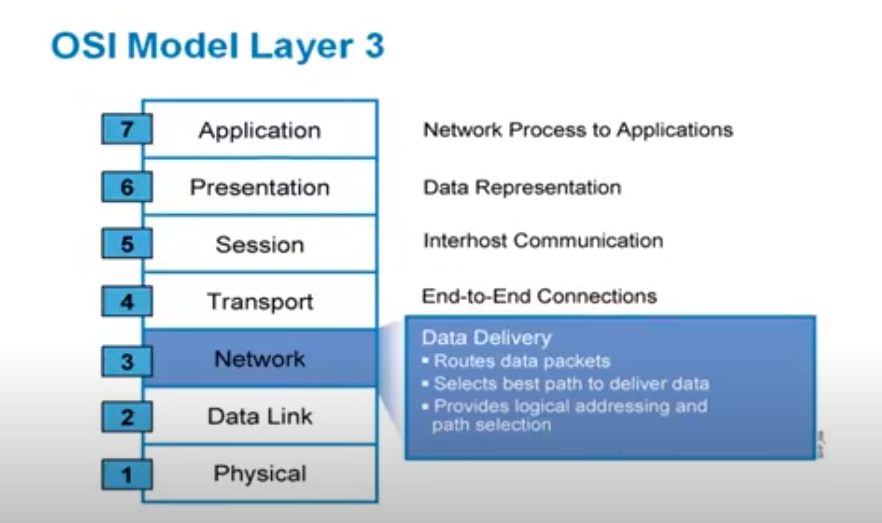

- 最主要的是IP和Routing, 實現數據轉發

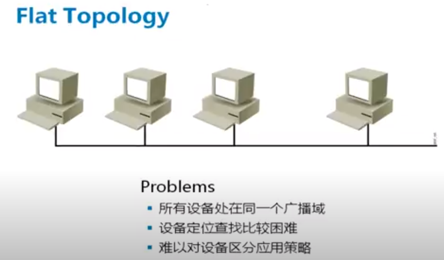

- 對於僅有MAC address的網卡, 是平面的結構方式
- 所有的設備在同個廣播域 (one -> multi)
- 為了security, 對網路做隔離劃分
- 僅僅通過MAC去找裝置是很困難的

- 將設備分層不同的網路, 對不同的網路設置不同的地址

### IP

- IP協議
    - 層次化的結構; 加入家庭地址的概念
    - 非連接協議: 想傳就傳, A -> B不用檢視狀態(不保證data devlivery)
    - 連接協議(TCP): 傳輸數據前要保持連線狀態, 傳輸前要協商(頻寬低)
    - 被切為packet傳輸
    - IP不管data recovery
- IP adress
    - 32-bit length total
    - Network(地址)/Host(名字), 兩個長短不一定

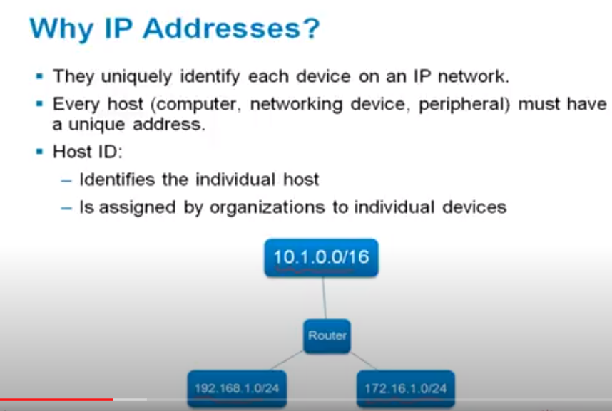

- 同一網段(Network)是透過MAC address通訊; 不同網路的通訊要透過Router完成

#### IPv4 Header

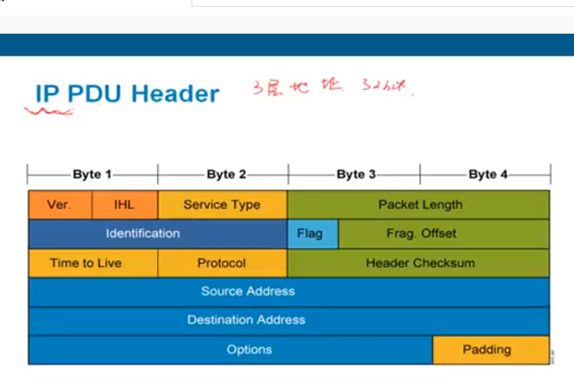

- Service_Type: 做QoS用; 對數據包標記prioirty (like audio, video, etc..)
- ID/Flag/Frag.Offset: 用來做分片標示; 單次僅能傳輸MTU(1500B for ethernet) size; 所以要進行分片
    - ID: 標記同個數據包
    - Frag.Offset: 標記順序
- TTL: 防止IP packet無限制傳輸; 每經過一個3-layer device時就會--; 減到0就不會再送
- Protocol: 多路復用; 區分上層的TCP/UDP
- Options: 通常不用, 和IPv6的定義有很大的不同

#### IP address

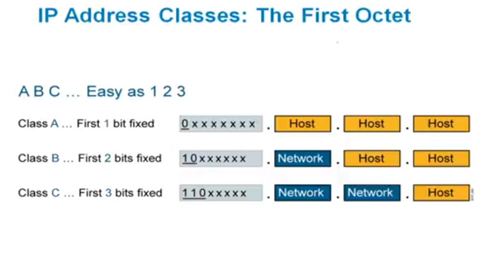

- A/B/C: 正常使用的地址
    - A: 0b0; 規定前8-bit是Network, 主機比較多 (給大型網路使用)
    - B: 0b10; 規定前16-bit是Network (中等網路)
    - C: 0b110; 規定前24-bit是Network (留給小網路)
- D: 組播. 0b1110
- E: 保留. 0b11110

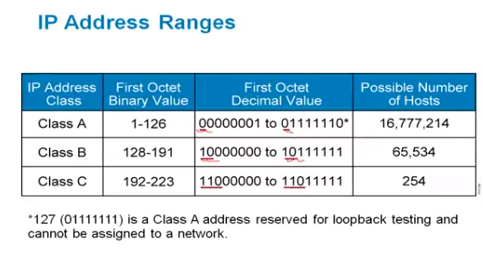

- 上圖就是各類的範圍 (現在可能不會這麼使用)

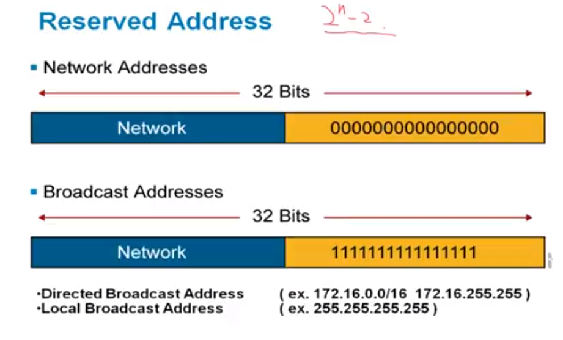

- host段中, 有兩個保留的address
    - 全0代表網段 (僅代表區域), 不能標示addrss
    - 全1代表廣播地址; 所有設備都要處理廣播數據

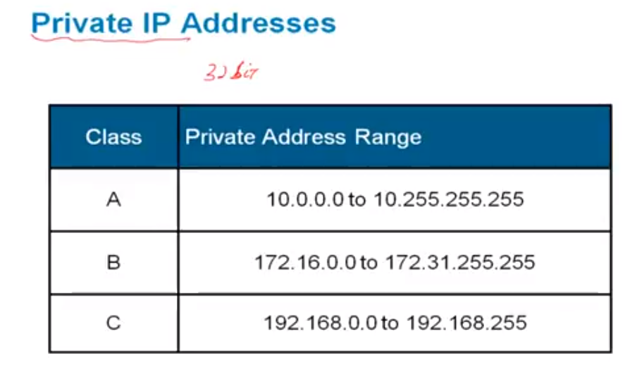

- 上面是不能出現在公有網路的IP
- 要使用NAT轉換才能往公有網路發送數據

#### DHCP

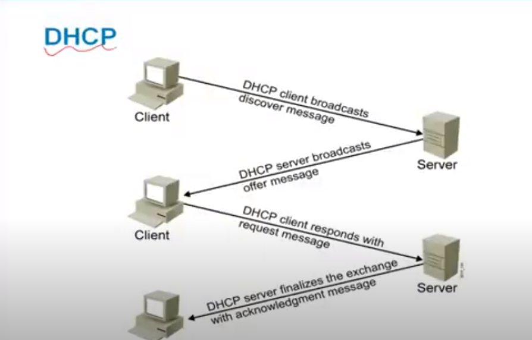

- 自動獲取網路地址, 必須要有DHCP server

#### DNS

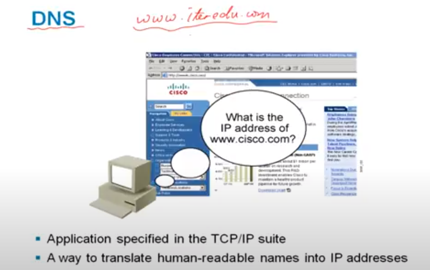

- 通過DNS server把網域轉和為IP address

#### ARP

- 實現把IP -> MAC的mapping
- 使用廣播叫所有人反饋IP: 172.16.3.2的MAC address

#### ICMP

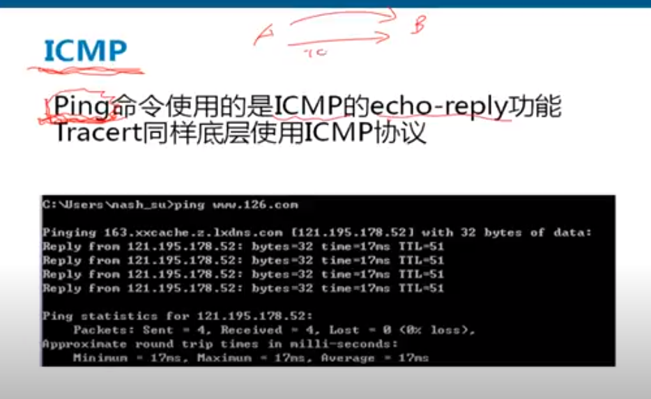

- 看目標主機可不可達; 最常見的就是PING

### Rounting

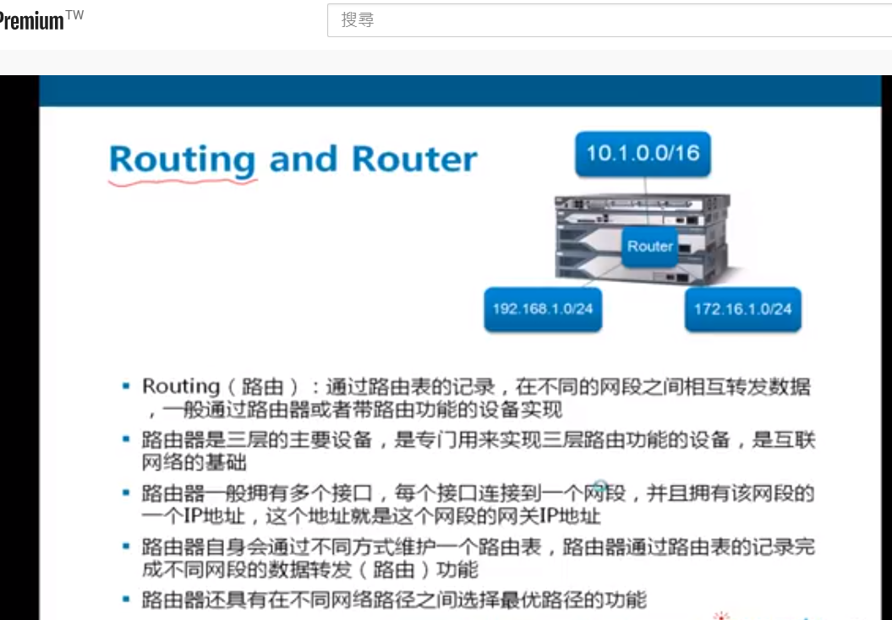

- Routing: 將數據在不同的網段轉發數據
- Router用來隔離廣播域 (永遠不轉發廣播, 廣播會消耗網路頻寬)
- gateway: 網段中的host如果想要往其他網段發送數據, 就要先送到gateway

#### Routing Table

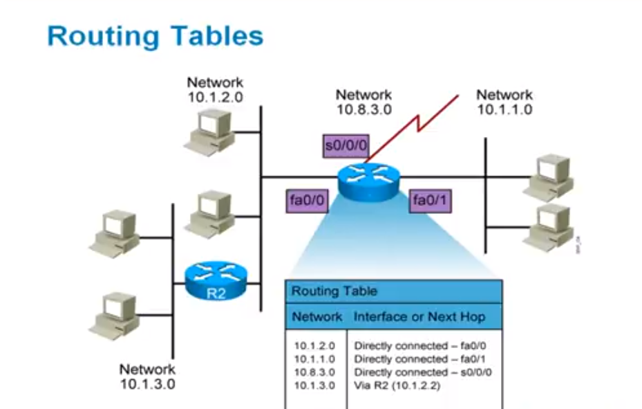

- 把IP根據table轉發

## IPv6

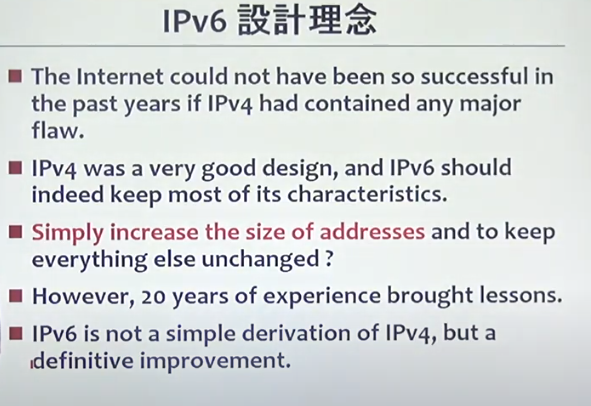

為何要IPv6

- 增加address size
- 增加QoS和Security

### IPv6 Header

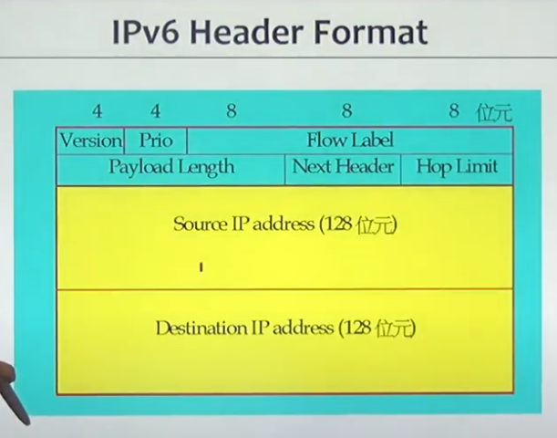

對照[IPv4 Header](#ipv4-header)

- header比較精簡; 

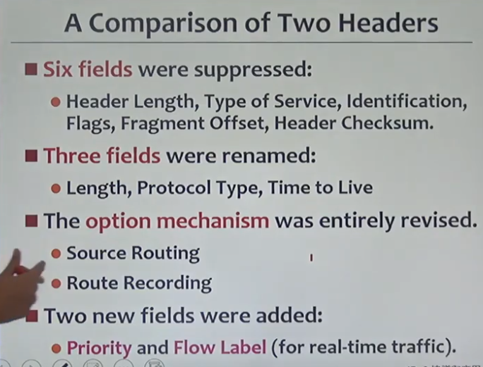

- 很多欄位被刪除, 用其他方式表示
- length/protocol type/TTL都用其他方式命名
- option的方式完全修改
    - Source Routing: 指定封包經過哪些router IP
        - Option加上IP1, ...等router的IP
    - Route Recording: 經過的router把他的IP記錄下來
- 新的欄位, 用以QoS用
    - Priority
    - Flow Label

整理如下

1. IPv6的header長度固定 (40 bytes)
2. Header Checksum拿掉
3. Segmentation的功能也拿掉; 由source傳送前自行切包. Router不再做切包的事

#### Option for Extension Header

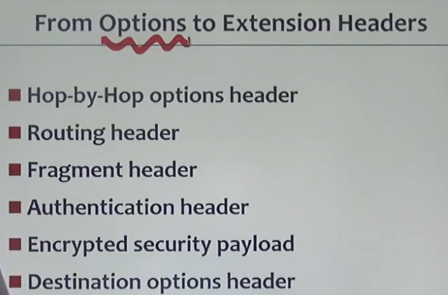

- Hop: 指的是router
- 這些header可有可無

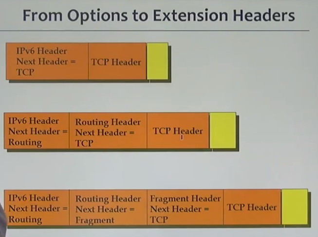

- IPv6的header可以一連串串下去, 端看source要用什麼功能, 就塞入此header

#### Routing Header

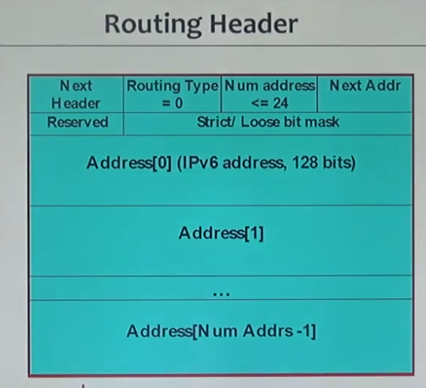

- sourse routing放的header
- Address: 放IPv6的address
- 最長放24個router
- Strict/Loose: 要不要只經過哪一些就好 (loosey toggle)

#### Fragment Header

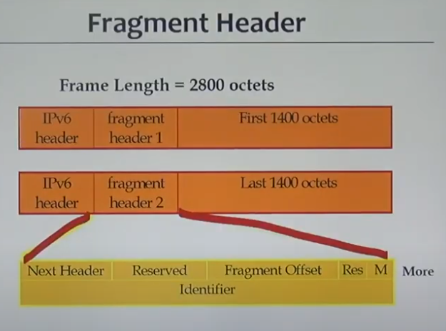

- Ex: 2800 bytes做切割
- 接收端組起來; 用ID和Fragment Offset的資訊組起來

### IPv6 Address

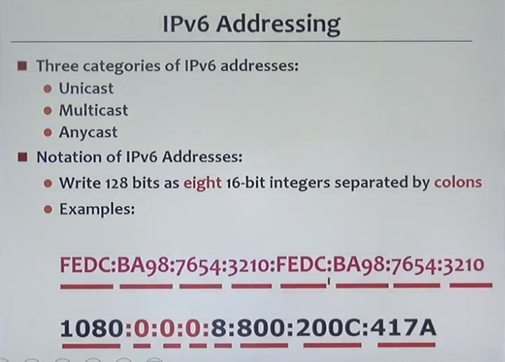

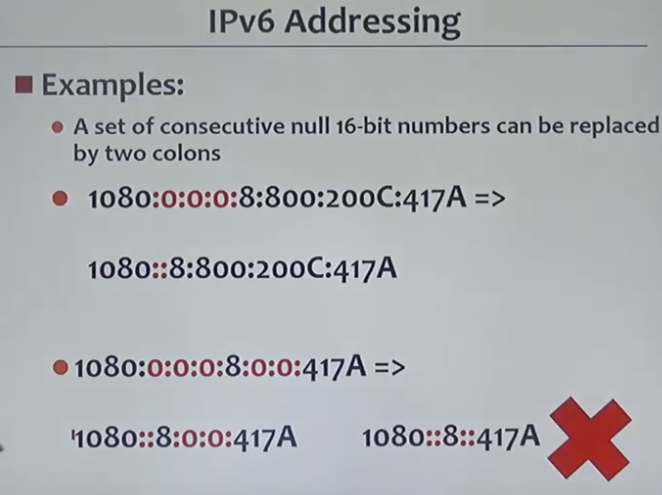

三種分類

- 1. Unicast: 送給特定
- 2. Multicast:
- 3. Anycast: IPv6獨有; 任何router能夠送出去就好

address的特色如下

- 128-bits; 分為8個16-bit的整數表示
- 連續***':'*** 代表都是 ***'0'***; 兩組以上就不能這樣表示 (因為不知道0的個數)

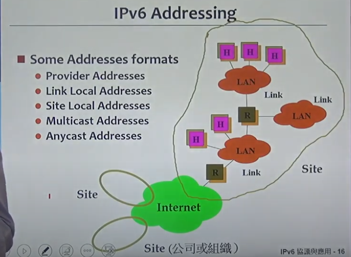

- Provider Addresses: 電信公司
- Link Local Addresses: Link相當於一個網路, 只能在內部使用; 電腦剛打開時會自動產生Link Local位置找router, 接觸上之後才會向router拿到global IPv6 address
- Site Local Addresses: site相當於很多link;
- Multicast
- Anycast
- Unicast

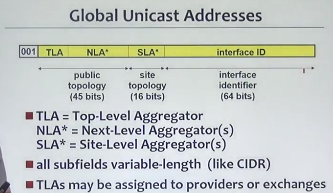

- TLA: 最大的電信商
- NLA: 第二級的電信商
- SLA: site level
- iterface ID: 

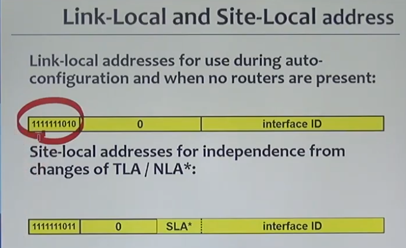

- 開頭***FE80***就是link local address

#### Interface ID

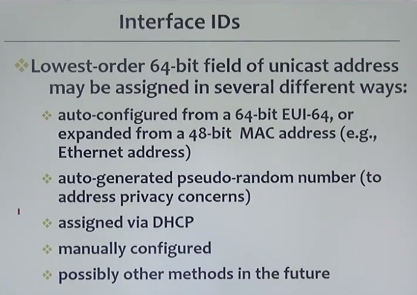

- 組成的方法很多
- auto-configure, 用以下的方式產生
    - 由正式網卡產生
    - PRN: 亂數產生
    - DHCP: 動態分配V6 IP
    - 人工設定

### IPv6 IGMP

IGMP for IPv6如下表:

