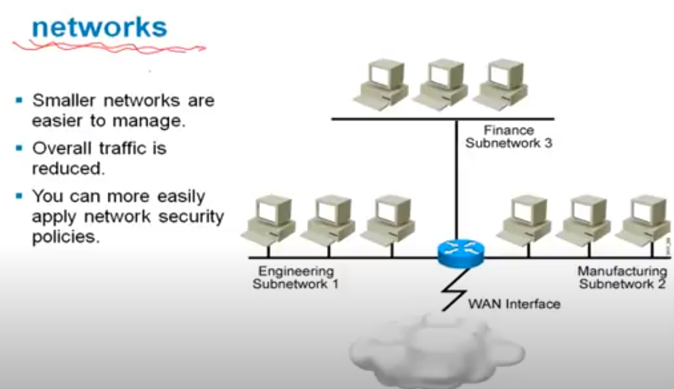
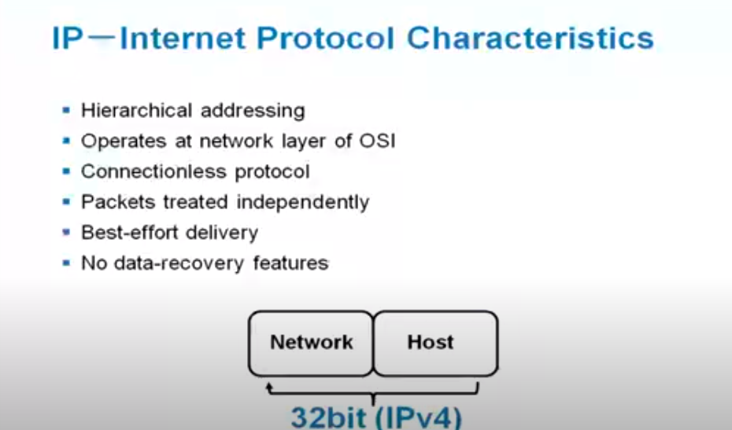
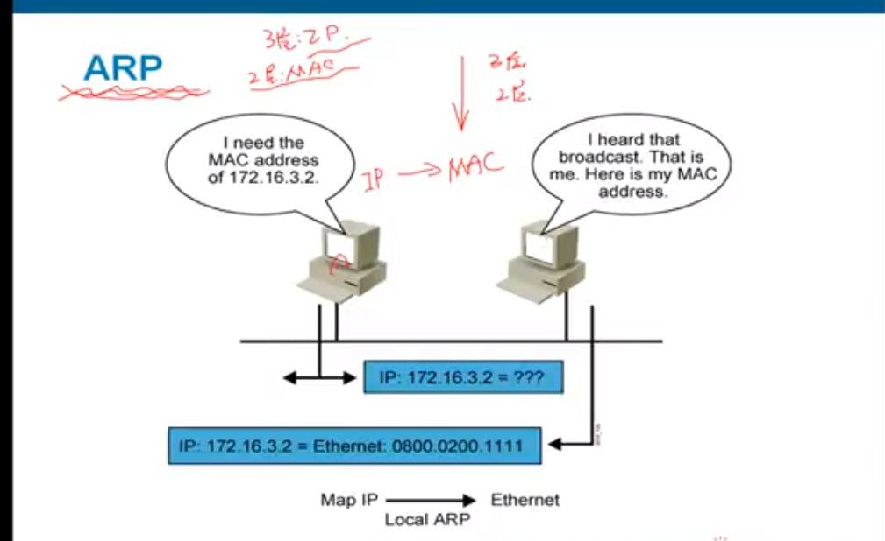

## MISC

[6LoWPAN](https://www.youtube.com/channel/UCrLmuEDuUdVhXwXbnXhbDwA)

[OSI layer](https://www.youtube.com/channel/UCTywnxREQ2MwebGwC0u-bBg)

## OSI Layer3 Network Layer

- 最主要的是IP和Routing, 實現數據轉發

- 對於僅有MAC address的網卡, 是平面的結構方式
- 所有的設備在同個廣播域 (one -> multi)
- 為了security, 對網路做隔離劃分
- 僅僅通過MAC去找裝置是很困難的

- 將設備分層不同的網路, 對不同的網路設置不同的地址

### IP

- IP協議
    - 層次化的結構; 加入家庭地址的概念
    - 非連接協議: 想傳就傳, A -> B不用檢視狀態(不保證data devlivery)
    - 連接協議(TCP): 傳輸數據前要保持連線狀態, 傳輸前要協商(頻寬低)
    - 被切為packet傳輸
    - IP不管data recovery
- IP adress
    - 32-bit length total
    - Network(地址)/Host(名字), 兩個長短不一定

- 同一網段(Network)是透過MAC address通訊; 不同網路的通訊要透過Router完成

#### IPv4 Header

- Service_Type: 做QoS用; 對數據包標記prioirty (like audio, video, etc..)
- ID/Flag/Frag.Offset: 用來做分片標示; 單次僅能傳輸MTU(1500B for ethernet) size; 所以要進行分片
    - ID: 標記同個數據包
    - Frag.Offset: 標記順序
- TTL: 防止IP packet無限制傳輸; 每經過一個3-layer device時就會--; 減到0就不會再送
- Protocol: 多路復用; 區分上層的TCP/UDP
- Options: 通常不用, 和IPv6的定義有很大的不同

#### IP address

- A/B/C: 正常使用的地址
    - A: 0b0; 規定前8-bit是Network, 主機比較多 (給大型網路使用)
    - B: 0b10; 規定前16-bit是Network (中等網路)
    - C: 0b110; 規定前24-bit是Network (留給小網路)
- D: 組播. 0b1110
- E: 保留. 0b11110

- 上圖就是各類的範圍 (現在可能不會這麼使用)

- host段中, 有兩個保留的address
    - 全0代表網段 (僅代表區域), 不能標示addrss
    - 全1代表廣播地址; 所有設備都要處理廣播數據

- 上面是不能出現在公有網路的IP
- 要使用NAT轉換才能往公有網路發送數據

#### DHCP

- 自動獲取網路地址, 必須要有DHCP server

#### DNS

- 通過DNS server把網域轉和為IP address

#### ARP

- 實現把IP -> MAC的mapping
- 使用廣播叫所有人反饋IP: 172.16.3.2的MAC address

#### ICMP

- 看目標主機可不可達; 最常見的就是PING

### Rounting

- Routing: 將數據在不同的網段轉發數據
- Router用來隔離廣播域 (永遠不轉發廣播, 廣播會消耗網路頻寬)
- gateway: 網段中的host如果想要往其他網段發送數據, 就要先送到gateway

#### Routing Table

- 把IP根據table轉發

## IPv6

為何要IPv6

- 增加address size
- 增加QoS和Security

### IPv6 Header

對照[IPv4 Header](#ipv4-header)

- header比較精簡; 

- 很多欄位被刪除, 用其他方式表示
- length/protocol type/TTL都用其他方式命名
- option的方式完全修改
    - Source Routing: 指定封包經過哪些router IP
        - Option加上IP1, ...等router的IP
    - Route Recording: 經過的router把他的IP記錄下來
- 新的欄位, 用以QoS用
    - Priority
    - Flow Label

整理如下

1. IPv6的header長度固定 (40 bytes)
2. Header Checksum拿掉
3. Segmentation的功能也拿掉; 由source傳送前自行切包. Router不再做切包的事

#### Option for Extension Header

- Hop: 指的是router
- 這些header可有可無

- IPv6的header可以一連串串下去, 端看source要用什麼功能, 就塞入此header

#### Routing Header

- sourse routing放的header
- Address: 放IPv6的address
- 最長放24個router
- Strict/Loose: 要不要只經過哪一些就好 (loosey toggle)

#### Fragment Header

- Ex: 2800 bytes做切割
- 接收端組起來; 用ID和Fragment Offset的資訊組起來

### IPv6 Address

三種分類

- 1. Unicast: 送給特定
- 2. Multicast:
- 3. Anycast: IPv6獨有; 任何router能夠送出去就好

address的特色如下

- 128-bits; 分為8個16-bit的整數表示
- 連續***':'*** 代表都是 ***'0'***; 兩組以上就不能這樣表示 (因為不知道0的個數)

- Provider Addresses: 電信公司
- Link Local Addresses: Link相當於一個網路, 只能在內部使用; 電腦剛打開時會自動產生Link Local位置找router, 接觸上之後才會向router拿到global IPv6 address
- Site Local Addresses: site相當於很多link;
- Multicast
- Anycast
- Unicast

- TLA: 最大的電信商
- NLA: 第二級的電信商
- SLA: site level
- iterface ID: 

- 開頭***FE80***就是link local address

#### Interface ID

- 組成的方法很多
- auto-configure, 用以下的方式產生
    - 由正式網卡產生
    - PRN: 亂數產生
    - DHCP: 動態分配V6 IP
    - 人工設定

### IPv6 IGMP

IGMP for IPv6如下表:

## Sensor Network 

為了support Smart Object; 那何謂smart object?

- 具有傳感功能的embedded system objects
    - 量測溫度
    - light switch
    - 工業4.0

- 所以需要以下的三個重要功能
    - Processor (16 ~ 32bit MCU)
    - memory
    - low power wireless communication device

- 其中要能夠連上internet, 最重要的是能夠讓object具有auto configure IPv6 address並連網的能力
- 那如何讓IPv6能夠給sensor network使用?
- 所以必須讓IPv6瘦身, 讓IP整合到smart object

Note: 
    
    所以最重要的是讓現有的IP protocols 能夠leverage到smart object上, 就能夠直接用IP Protocol連網

- 沒有現成的IP Protocol能夠mount在802.15.4
- 因為把IP/TCP搬到802.15.4, 並不能滿足他的frame
    - IPv6 header為40 bytes; TCP header 20 bytes; 802.15.4的MTU僅有127 bytes, 就只有一點空間可以傳data
- 802.15.4可以做node的multi hoc傳輸, 就牽涉到rounting的問題
    - DSR: 需要紀錄所有經過的router
    - AODV: 需要存vector table
    - 以上兩個routing protocol的封包也比較大, 也沒辦法放到802.15.4的封包

Low Power and Lossy Network(LLN)的性質

- sensor network的缺點: 功率低, 距離近, 不穩定, 資料易流失
- 那這種network要怎麼做rounting? 顯然不適合傳統的routing方式

### IPv6 for smart object

- 把LLNs變成end-to-end IP based solution, 把LLN上面的node架上IP, 端點之間就能夠用IP連接起來
- 但又不希望做傳統protocol translation的gateways & proxies

- 如果不是用IP protocol, 就需要protocol translation gateways把LLNs和IP連起來, 就會遇到
    - 沒辦法規模化
    - 沒辦法操作
    - 很難安裝
    - 破壞了end-to-end的security, 

- 左圖: 透過gateway的話, 增加複雜度, 也沒辦法大規模部建
- 右圖: 使用IP, 透過IP router就能夠連網

## 6LoWPAN (IPv6 over Low-Power Wireless Perosnal Area Network)

- 左邊的每個node都是sensor node, 都是低功率wifi
- sensor network要與右邊的IP nework相連的話, 就需要LoWPAN Router作為gateway

6LoWPAN的特色:

- 封包size 127bytes, meets 802.15.4
- 16-bit or 64-bit MAC addresses
- 頻寬不高 (250kB)
- 可以和傳統的IP network互連 (link ethernet or WiFi), 就能夠跟真正的application互動

### Sturcture

- MAC layer用的是802.15.4, Network layer跑IPv6
- 6LoWPAN是介於IPv6和802.15.4之間 (二三層之間)
- 要做的是把IPv6透過6LoWPAN做壓縮, 拆包, 就相當於是Adaption layer

- IPv6的minimum MTY最少需要1280bytes, 所以需要做拆包
- 要把48-bytes header(40 for IP, 8 for UDP)做壓縮
- Chained Header format, 和IPv6一樣, 並透過Dispatch欄位標記 

### 6LoWPAN Header Compression

對比一下 [IPv6 Header](#ipv6-header)

- 0b011: 代表後面是header壓縮說明
- carrier inline: 沒壓縮內容, 會帶在後面In-line IPv6 Header Bits
- TF: 代表In-line IPv6 Header Bits會帶有那些內容
    - ECN: 
    - DSCP: 
- NH: 下一個header到底有沒有壓縮
    - 0: 下一個header沒有壓縮 (like TCP)
    - 1: 下一個header有壓縮 (like UDP)
- HLIM: 代表該筆封包經過幾次hop就要出網路, router收到後會--, 減到0就丟掉
    - 0: 代表hop counter沒有壓縮, 會帶在in-line IPv6 Header Bits

***Context***:

    IPv6有分為link local(開機自行產生的, fe80::) 和global(router給的); 
    如果是global IPv6, 他的prefix一般都會相同, 所以就用context表示 (as IPv6 Prefix)
    在sensor node裡面, router最多給16種不同的prefix, 並用4-bit編號

- CID: 根據source/destination address用的
    - 0: 代表編號0, 後面也不用再跟1-bytes prefix
    - 1: 有的話, CID欄位會在插8 bit (4-bits for source IP prefix, 4-bits for destination IP prefix)

- SAC/DAC:
    - 0:
    - 1: Context-based: 就是用編號 (prefix)

- SAM/DAM: 會有多長
    - 3 (elided): IPv6 address在In-line IPv6 Header Bits可以省略; 可以從MAC address導出來, 或是用link local address (fe80::)

- M: multicast or others

#### Traffic Class and FLow Label

- TF的定義

#### Next Header/Hop Limit

- NH: next header沒有壓縮
- NHC: next header壓縮的本文

### IPv6 Address Compression

#### IPv6 Unicast

- IPv6 Unicast address分為Prefix和Interface ID
- Prefix:
    - address在6LoWPAN通常會有相同的prefix (router會給相同的prefix)
    - 通訊通常不會和太多的central devices通訊 (因為通常都是做數據收集, 再由central送到internet) 
    - prefix建立contextx做0 ~ 15的編號 
    - 只有簡單的state
- Interface ID:
    - interface ID通常會在auto configuration的時候, 由L2 MAC address取得
    - 所以若interface ID可以由layer 2 MAC address取得的話, 就可以不用紀錄

- SAM/DAM: 
    - 0b11: 像是link local (fe80::(MAC address))
    - 0b10: 112-bit prefix省掉
    - ..

- SAC/DAC:
    - 0 (stateless mode): 代表是link local (目的是去找router)
    - 1 (context-based): 代表是router給的global IP address

#### IPv6 Multicast

Note:

    Flag = 0, Scope = 2, 就是一開始的時候IPv6做群播 
    像是找router (router certiciation, link-local all-routers), 或是找neighboor (link-local all nodes)

- GroupID: 會有不同的壓縮方法
    - DAM = 11: router做群播

### IPv6 Next Header Compression

- 每一個header會記錄next header有沒有壓縮
- 像是HC, 紀錄next header (like UDP)是怎麼壓縮的

#### UDP Header Compression

UDP header怎麼做壓縮?

- UDP Port不用開放這的大, 所以讓
    - 讓UDP Port落在61616 ~ 61632 (only 4-bits)
    - IPv6本身就有長度欄位, 所以簡化Length
    - checksum就看有沒有其他protocol就已經簡化了

所以先把UDP先用1-bytes的control byte, 描述如何壓縮UDP

- C: checksum能不能被壓縮
- P: 
    - 0b'00: 代表port number沒有辦法壓縮
    - 0b'1/2: source/destination port的前8個bit可以省略
    - 0b'11: 代表port number範圍落在了61616 ~ 61632之間

### example 

- 從48-bytes壓縮成7-bytes
- Source/Destination IID從link header來
- 整個len就從link layer的Len來

- global的IP用context編號
- source/dest prefix用編號, 

- 找neighboor/router用的

### Neighbor Discovery

- 傳統的IPV6有neighbor discovery的方法, 去找鄰近的router和找到IPv6 Address Prefix
- 那怎麼從IP address轉換成MAC address? (Note: IPv6沒有IRP protocol)
- node沒開機怎麼發現?

- 通常ND都是在 
    - LAN網路 (connect interface, 比較穩定的網路)

- 但6LoWPAN有以下的特色
    - Lossy: 無線網路不穩定
    - Asymmetric radio environment: 個別node的傳輸距離不同
    - multicast traffic: 耗電
    - address resolution: 並沒有這麼樣的需求 (因為通常只送給central, 也不太需要常換MAC)
    - EUI-64: sensor node獨有的

- Border Router: 對internet連接的
- 1. 6LoWPAN Host開機, 找Router (RS: Router solicitation)
- 2. Router: router收到後做回應, 回RA (router advertisement)
- 3. NS(找鄰近的node) + ARO(位置註冊)
- 4. NCE: 做暫時位置儲存
- 5. DAR/DAD/DAC: 檢查address有沒有重複
- 6. 連線完成, 可以向internet連線

### 6LoWPAN in an IP Stack

- 在802.15.4和IP之間

