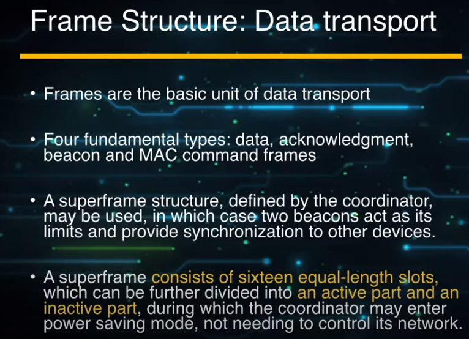
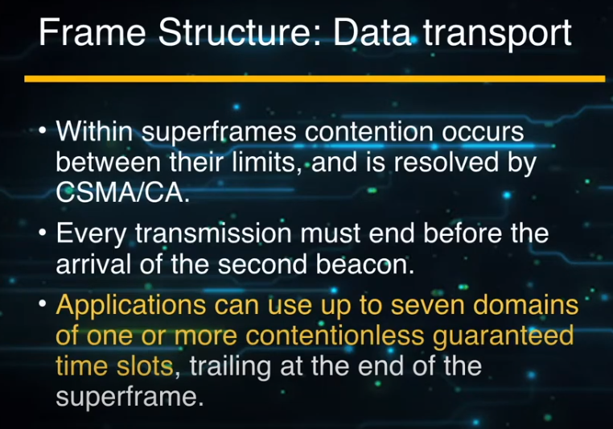
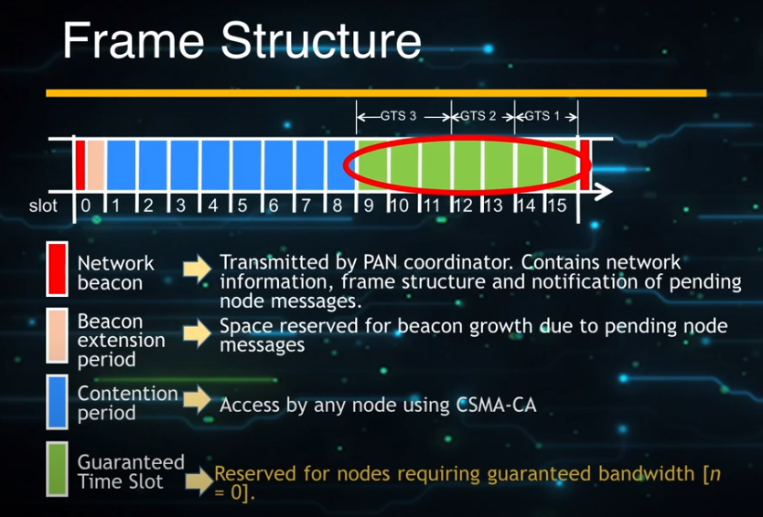

## MISC

[802.15.4 MAC](https://www.youtube.com/watch?v=dqsaEHyERMs)

## Introduction

需要定義一個Frame的結構

- Beacon Mode: 用slotted 來保證資料能夠傳到
- Non-Beacon Mode: non-slotted CSMA-CA來做; 想傳就傳

### Type and Role

- FFD: 有所有功能的node
    - 可以為PAN coordinator
    - 可以是simple coordinator
    - simple device
- RFD: 只能為device

- device必須和coordinator通訊連線; coordinator則可以直接和coordinator連線
- 一個PAN只能有一個PAN coordinator

#### Coordinator

- 管理所有associate device
- 64-bit device address
    - 16 bit short address

### Frame Structure

- Frame為基本的Data傳輸
- 有四種data type
    - data
    - ACK
    - beacon
    - MAC command
- Super Frame
    - 由coordinator來定義; 所以coordinator定義SF時必須提供足夠的服務給network使用
    - 夾著兩個Beacon之間的frame; 資料要在這兩個beacon之間傳完
    - 分為active(收送資料)和inactive (休息)
    - 資料分為兩部分
        - 一部分用競爭的(CSMA/CA)
        - 一部分用免競爭的(slot based), 允許某些資料用Low latency的方式傳輸
    - 一個SF最多保留7個guaranteed time slot

- beacon把frame框起來
- PAN coordinator定義SF, 把資料往下丟給device; 透過beacon通知裝置如何收送資料
- contention是用競爭的方式傳輸資料
