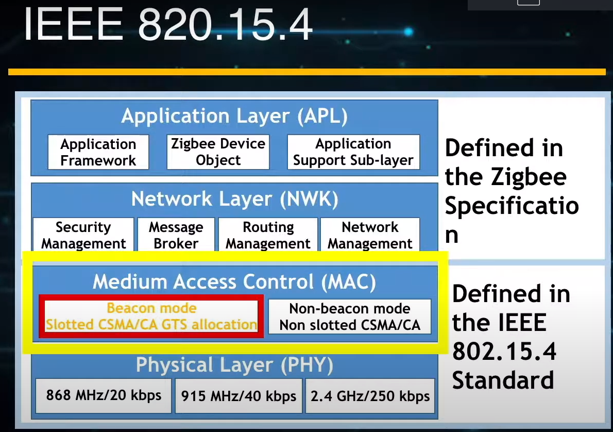
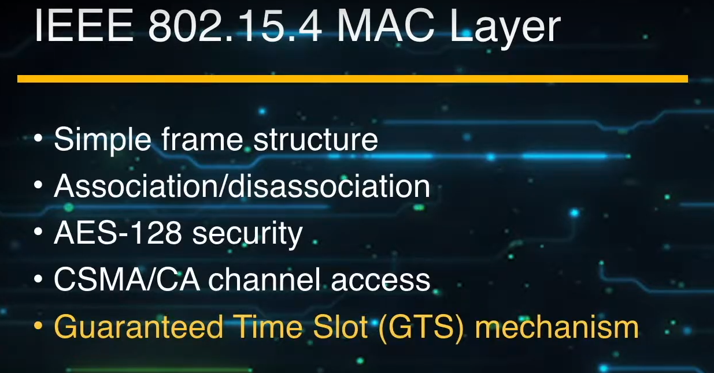
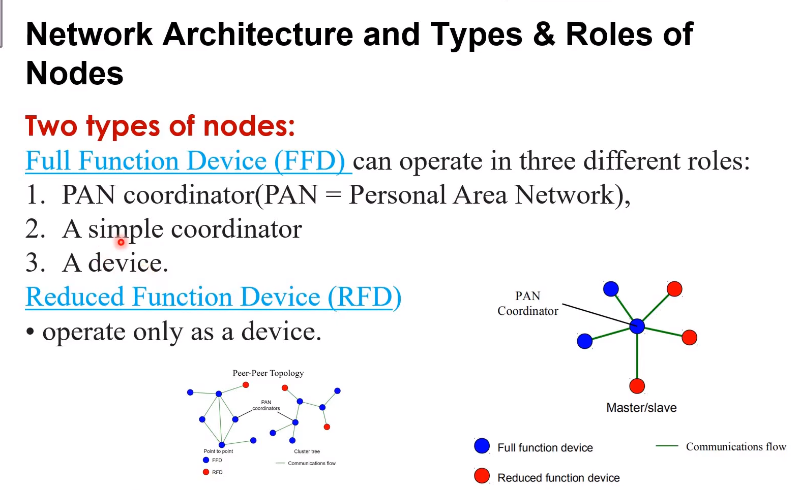
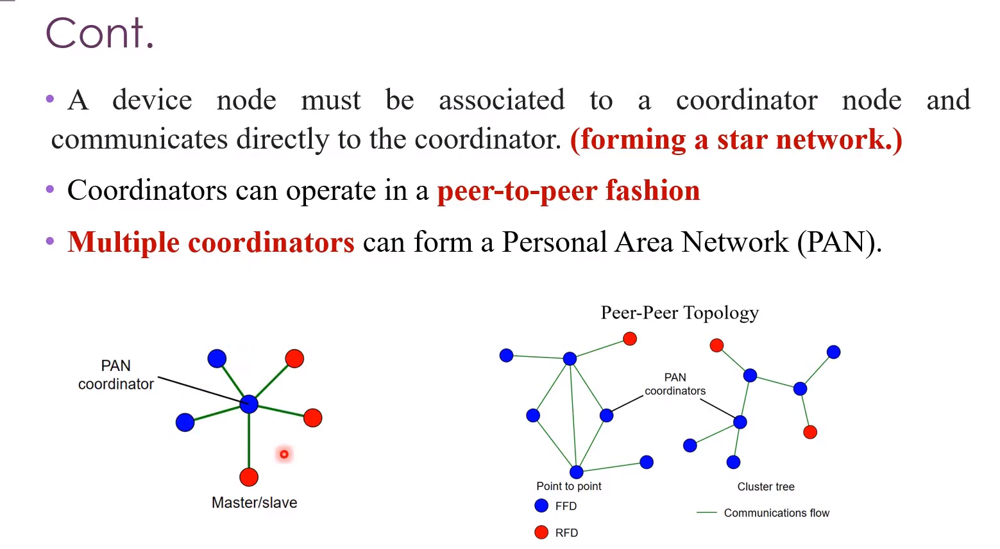
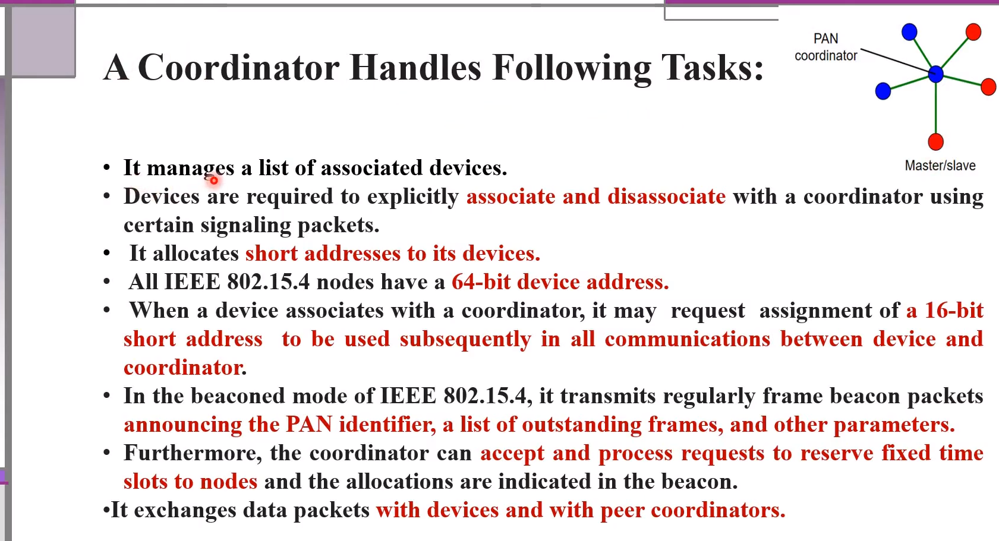

## MISC

[802.15.4 MAC](https://www.youtube.com/watch?v=exKnnRfPR44&list=PLvzhMI9KCrTSNDQ4g3BTkYU_t7A6C32hd&index=14)

## Introduction

需要定義一個Frame的結構

- Beacon Mode: 用slotted 來保證資料能夠傳到
- Non-Beacon Mode: non-slotted CSMA-CA來做; 想傳就傳

### Type and Role

- FFD: 有所有功能的node
    - 可以為PAN coordinator
    - 可以是simple coordinator
    - simple device
- RFD: 只能為device

- device必須和coordinator通訊連線; coordinator則可以直接和coordinator連線
- 一個PAN只能有一個PAN coordinator

#### Coordinator

