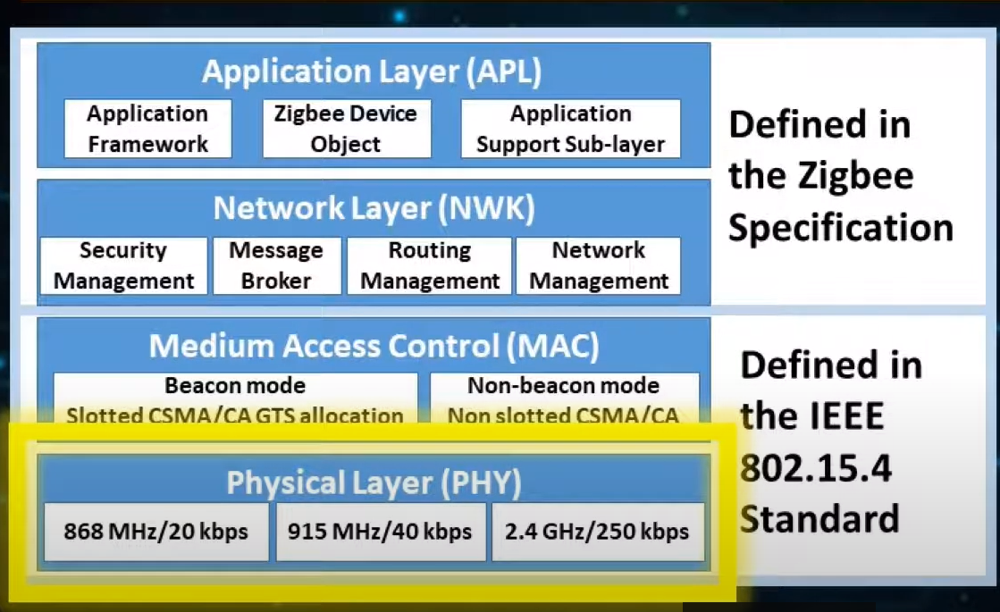
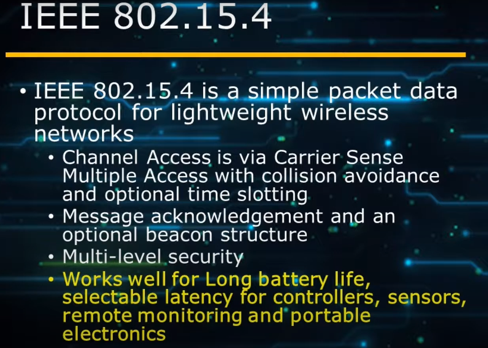
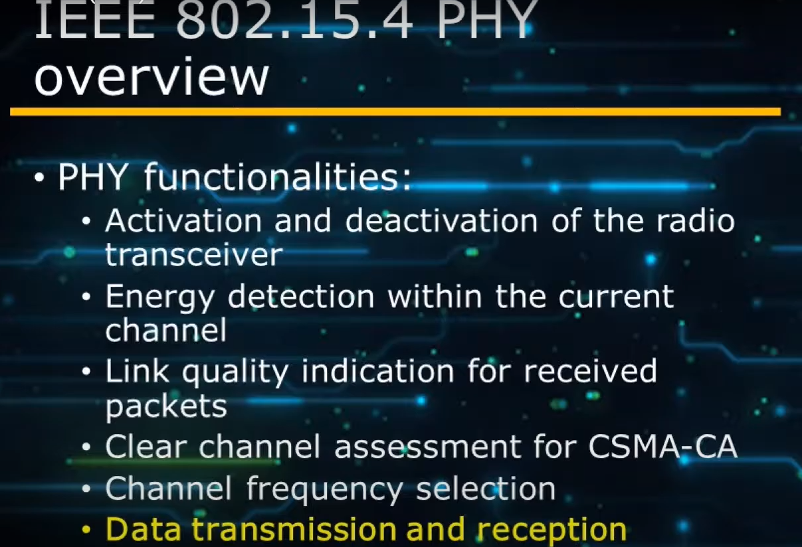
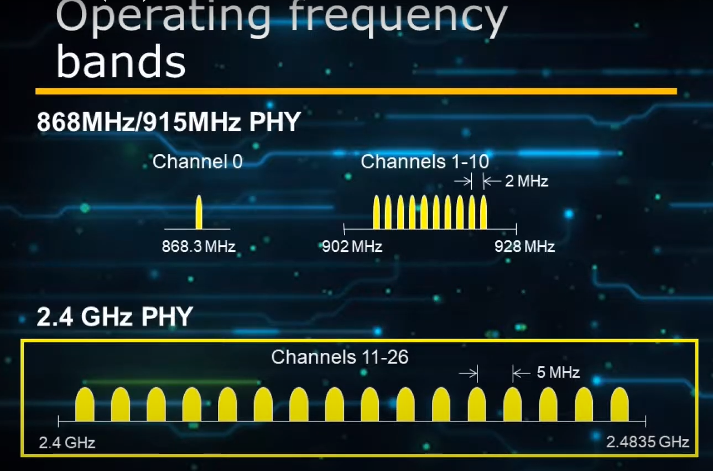
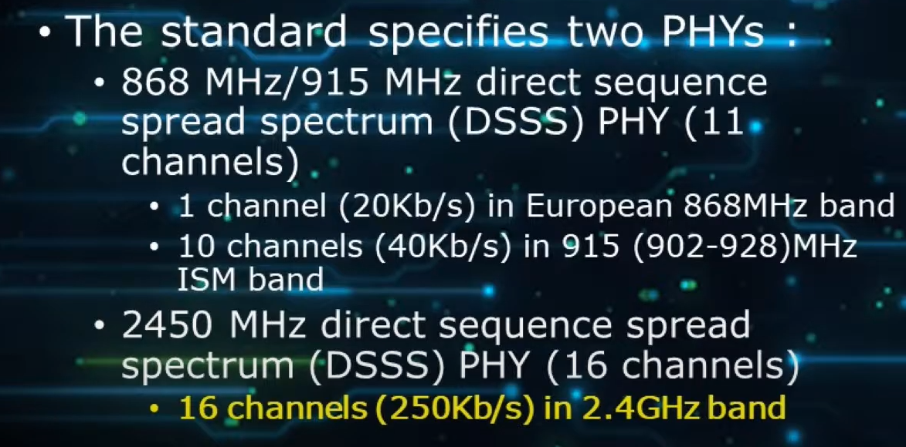
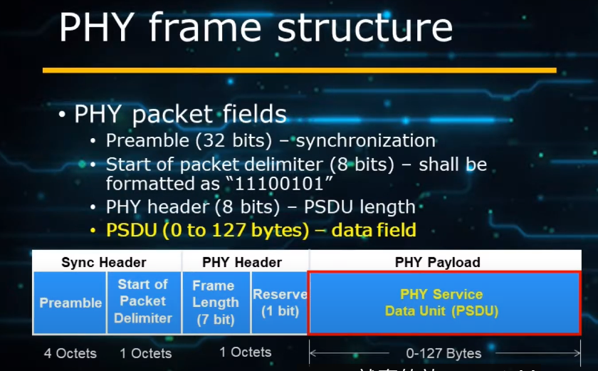
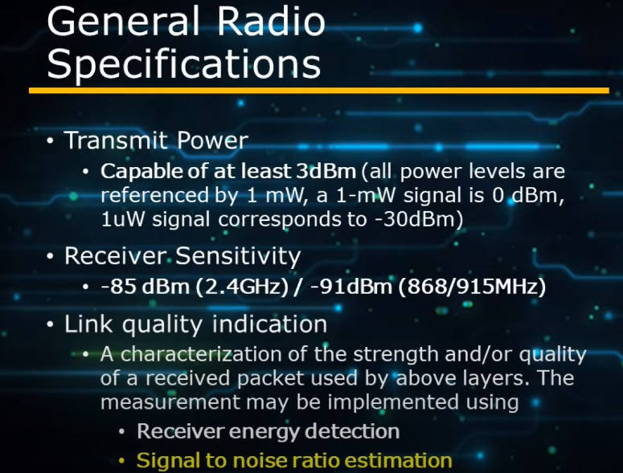
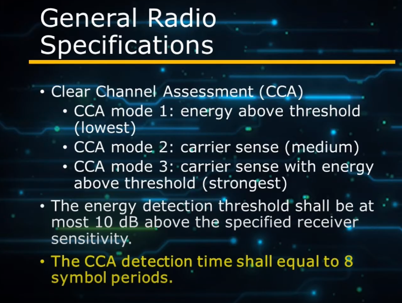
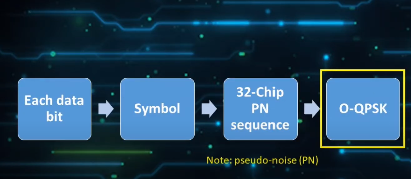

## MISC

[802.15.4 PHY intro](https://www.youtube.com/watch?v=JeUkPu7jMYE)

## Introduction

- 802.15.4是lightweight wireless network
    - 用的是CSMA-CA
    - 有optional的time-slot可以使用
    - 有message ACK和beacon (通常zigbee不太用)
    - 有省電的方式 (Super Frame), SF前可以傳資料, 後面就inactive不傳資料

- Energy Detection: 傳/收時先偵測energy是否小於某個threshold, 之後才決定要不要T/RX
- link-quality indication: RSSI夠大才有品質保證
- Clear channel assessment: 做sync 

### 802.15.4 Bands

- 2.4G是11~26 channel

### Data Structures

- preamble: 用來做同步
- Start of Packet: 固定的
- 最大127-bytes

### Radio Spec

- Tx Power
    - 至少3dBm
- RX
    - 至少-85 dBm
- Link quality由以下兩個決定
    - RX energy
    - SNR

#### CCA (clear channel assessment)

- CCA: 用來偵測無線狀態
    - mode1: 偵測energy的threshold
    - mode2: carrier sense (CSMA)
    - mode3: 兩個加起來
- energy detection的能力要比RX sensitivity高10dB
- CCA至少要聽8個symbol periods

#### Packet Tx

- bit -> symbol -> chirp -> O-QPSK

