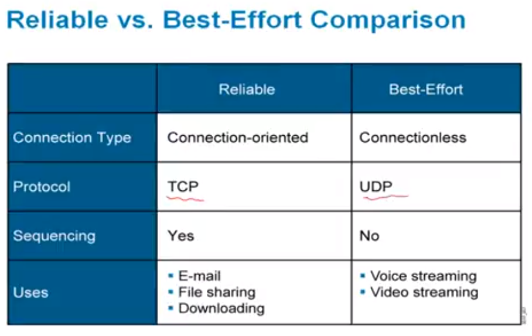
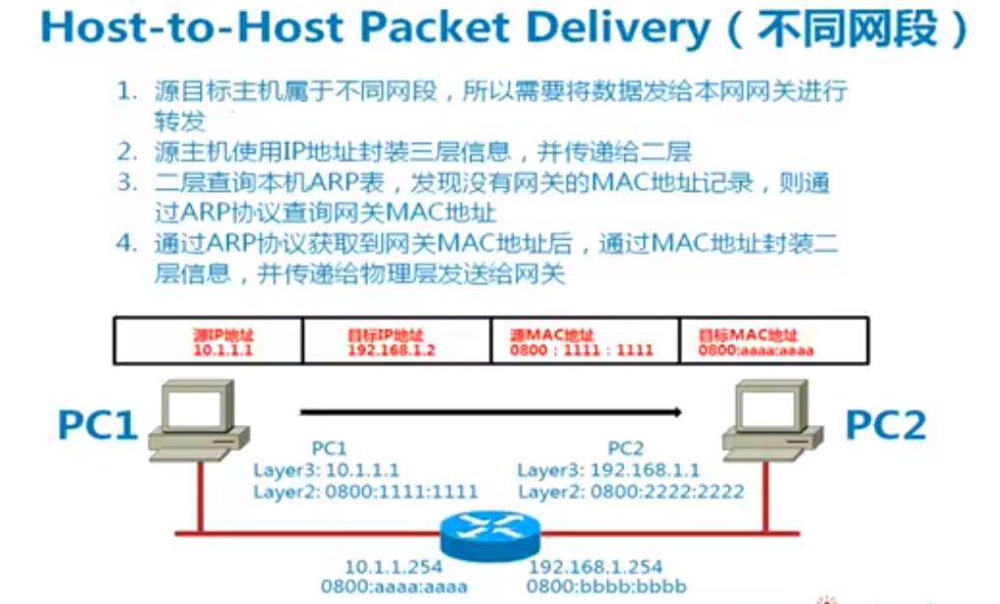

## OSI Layer4

- End-to-End連線傳輸
- 保證傳輸可靠性
- 數據重傳機制

- 會話層的多路覆用
- session的分段
- 做流控
- 面向連接協議: 需要先連線, 保障數據可靠性

### Multiplexing

- multiplexing: transport layer統一對上層應用程序提供服務 (TCP/UDP)
- trnasport有port(0~65535), 分辨不同應用層的端口
    - FTP: 2021
    - HTTP: 80
    - etc...

### TCP and UDP

- UDP: 就像IP協議, 非順序到達
    - 為了給第四層多路覆用的
    - 不提供數據的reliability
    - 非順序傳輸: 兩筆封包經過不同routing出去, 就有可能出現這種情況
    - 效率高, 傳輸語音/影音

- TCP: 面向連接, 需要先建連線交換訊息
    - 效率較低
    - 保證數據時序性
    - 雙向連接
    - 數據需要做ACK

#### UDP Header

- ***標準port指的是destination port***, source port可以任意
    - Ex: HTTP: 80
- checksum: 通禪在IPv4不太用, 以提升效率

#### TCP Header

- header length: TCP header不固定長, 因為有option
- urgent pointer: 做流控的

#### Mapping Layer 3 to Layer 4

上圖是IP header

- Protocol: 利用該欄位報layer4是TCP/UDP

#### Mapping Layer 4 to App layer

- layer4 to App用的是port number做映射
- DNS可以用TCP, 也可以用UDP; 一般使用UDP, 大量查詢才用TCP

### TCP

- TCP交換資料前要先建立連線

- TCP連接一般都使用3-way hand-shake
- EX:
    - 1. A send Syn to 1, 代表想建立連線 (SEQ = 100)
    - 2. B send ACK = 101, syc=1, ack=1, SEQ=300
    - 3. A send establissh, send ACK = 301

Note:

    ACK都是回覆希望對方下一次傳的SEQ number

- TCP做流控, 停止對方繼續傳送

### TCP Flow Control

- 一次ACK一筆的效率太低, 所以有window機制
- 多個數據一次ACK
- [TCP Header](#tcp-header)中的window size可以協商ACK window

- 用window機制做流控
- Ex: B -> A降低window size, 讓sender重傳3, 並且多傳4

- 上圖就是個基本的例子

## Packet Delivery

- 物理層的實體連線, 把兩個設備透過以下裝置連線
    - ethernet, etc

- 非一對一連接要互連的話, 是透過switch進行互連
- 第二層透過MAC address進行識別

- ARP: 把IP換成MAC address, 主機會維護ARP table

### Example: Host to Host (同網段)

- 此時的source/destination IP和source/destination MAC都是真實的address

### Example: Host to Host (不同網段)

- 如果發送的數據不在同個IP network, 就要先把數據發給gateway
- 此時gateway會有routing table, 把192.168.1.xxx映射到192.168.1.254 gateway上的MAC address (0800:bbbb:bbbb)
- desination MAC為gateway mac address
- router發現destination MAC是gateway, 就會知道是要進行轉發
- 所以每經過一個網段
    - Detination/Source MAC都會變 (是gateway MAC address)
    - Detination/Source IP都不會變 (是PC IP address)