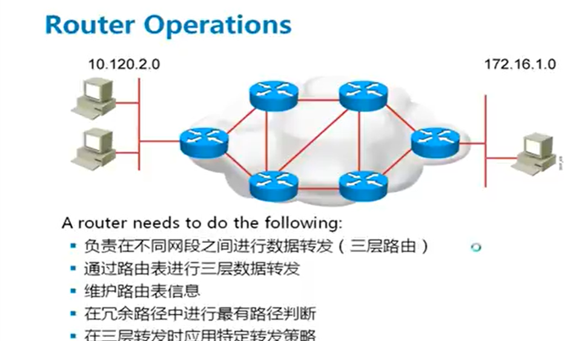
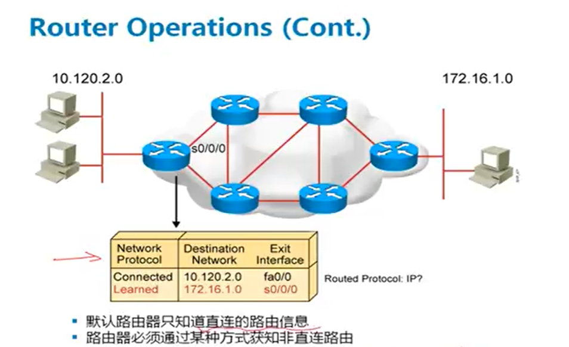
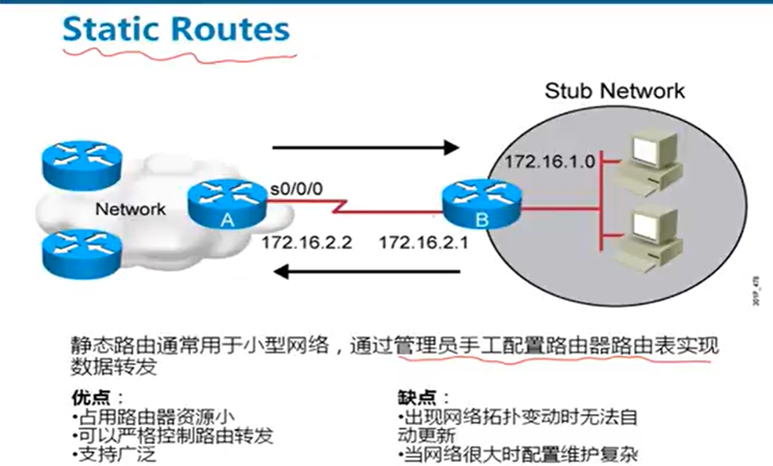
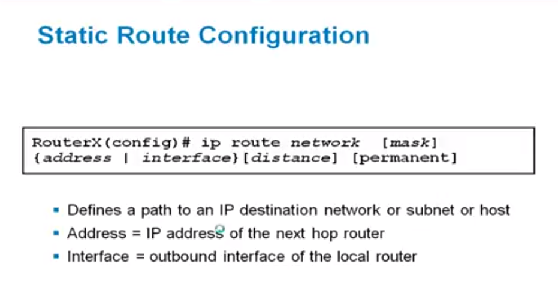
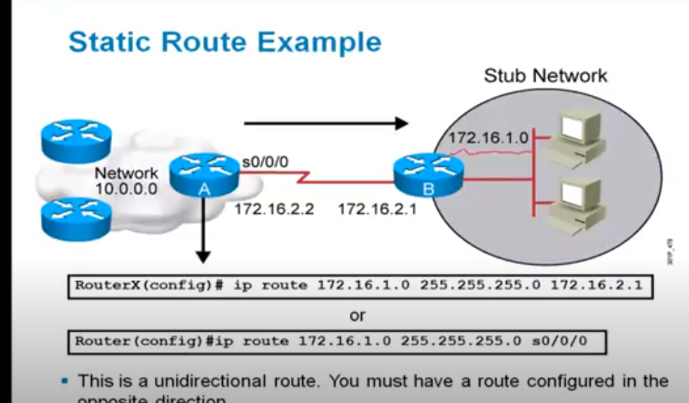
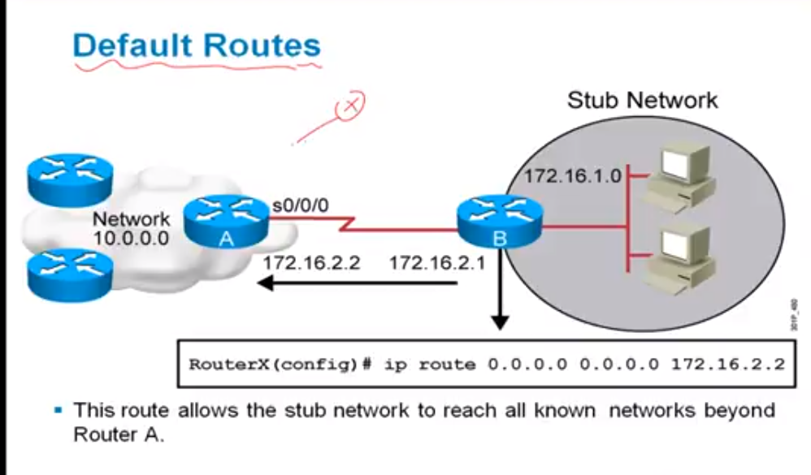

## MISC

[static routing](https://www.youtube.com/watch?v=1cSAnjje5-M&list=PLw6NObKC3AYlOKrX3Du3mrcp6d-4YdC54)

## Router 

- 第三層(IP), 在不同的網段(network)發送數據
- 通過routing table把網段轉發給相對應的router接口(Ex)
- 制定packet filer策略

- router只知道自己的直連接口
    - 每個接口都有IP address
    - 不同的接口不能配相同的network (因為router就是用來隔離網段的)
- 大型網路會有多個router, 所以router需要知道非直連網路的other routers

### Static Routes

- 手工輸入router路徑
- 只能用在網路數目很小的時候

#### IP Routes Matching

1. Router對數據進行精確匹配
2. Router只配對subnet mask規定的bit

Ex:
    
    今天有訊息給192.168.1.129

    192.168.1.128/30
    192.168.1.0/24
    192.168.0.0/16

    對於這三個路由條目都匹配, 但會選最精確的 (subnet mask最長的)

3. 需要找到一個輸出接口才能進行轉發
4. 如果沒有匹配routes, 就要丟棄數據, 並向source返回ICMP error message

#### example

- 配置到172.16.1.0的Host
- 172.16.2.1是下一跳gateway的IP address
- 或是打出接口 S0/0/0

直接打出接口和IP address還是有本質上的不同, 如下例子

有一個10.1.128.3的IP address...

1. 從目標網段10.1.128.0/23查表, 得知下一跳是在172.16.32.3
2. 從目標網段172.16.32.0/23查表, 得知下一跳是在192.168.1.254
3. 從目標網段192.168.1.0/24查表, 得知下一跳是在S0/0接口

結論:

    直接去出接口, 但不具備份性 (接口當掉就玩了)
    從IP gateway address去找, 有備份性, 但是效率不高

#### Default Routes

- 上網時有非常多的路由路徑 , 全部用靜態路由很麻煩也占空間, 此時需要default routes
- 全0: 通配router, 可以匹配任意路由條目 (最不精確). 永遠是最後一個匹配

#### Loading Balancing 
