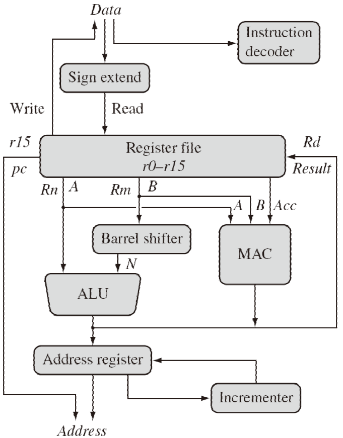
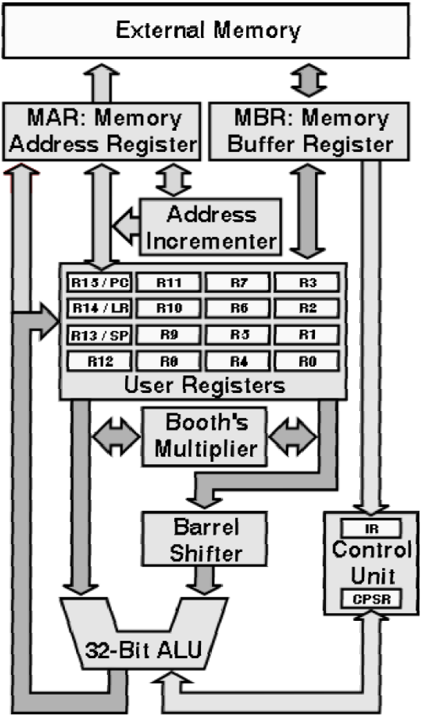
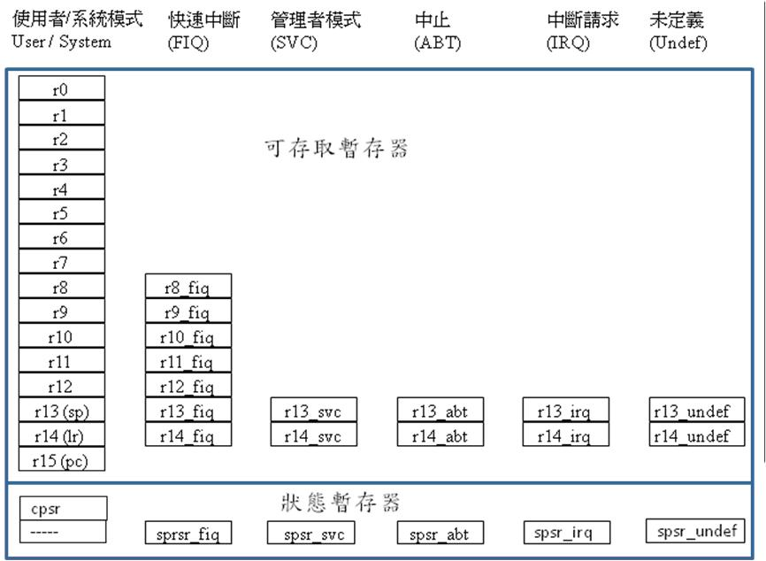

## MISC

[ARM instruction](https://www.youtube.com/watch?v=yHAdlr4pF30&t=8905s)

[ARM指令](http://hackfoldr.org/arm/https%253A%252F%252Fhackmd.io%252Fs%252FBkGRdKmsg)

## ARM Architecture

- ARM 採用 RISC, 又不全然是RISC (Ex: SIMD)
- Feature
  - a load-store architecture
  - 固定長度 32-bit instructions
  - 3-address instruction 形式

- Features rejected
  - 還是有些指令需要超過2個或2個以上的cycle執行
  

- Barrel Shifter: 
- MAC ( Multiply–accumulate operation ): 一些指令加速器

- 上圖從記憶體觀點來看架構
- CPSR (current program status register): 程式執行後的狀態 (ex: overflow, interrupt, etc)和ALU獨立

### ARM Registers

- 上圖並非全然對, 因為arm version/mode非常多; 不過大致都這樣
- banked register: 每個模式下可以存取的register並不同
- FIQ: 用來減少(nested) interrupt latency的模式
- IRQ: 
- nested interrupt: 
- CPSR

