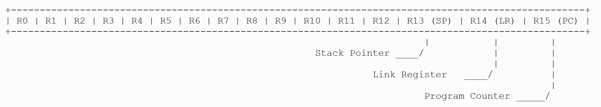
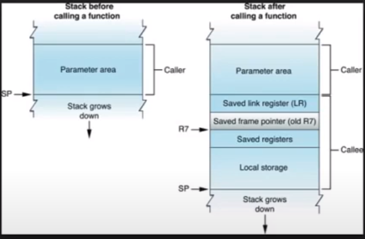
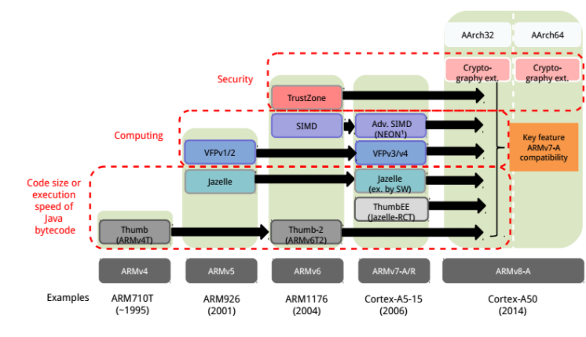
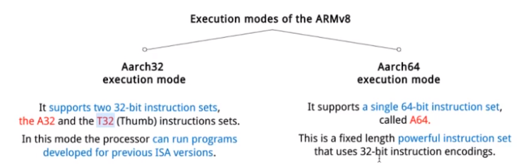
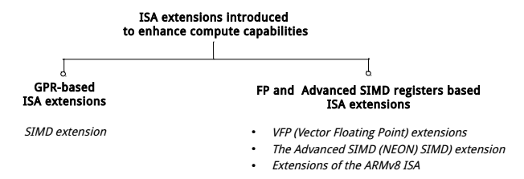
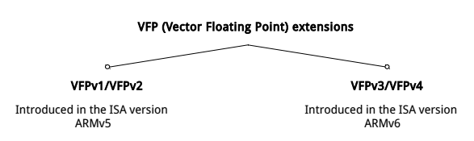
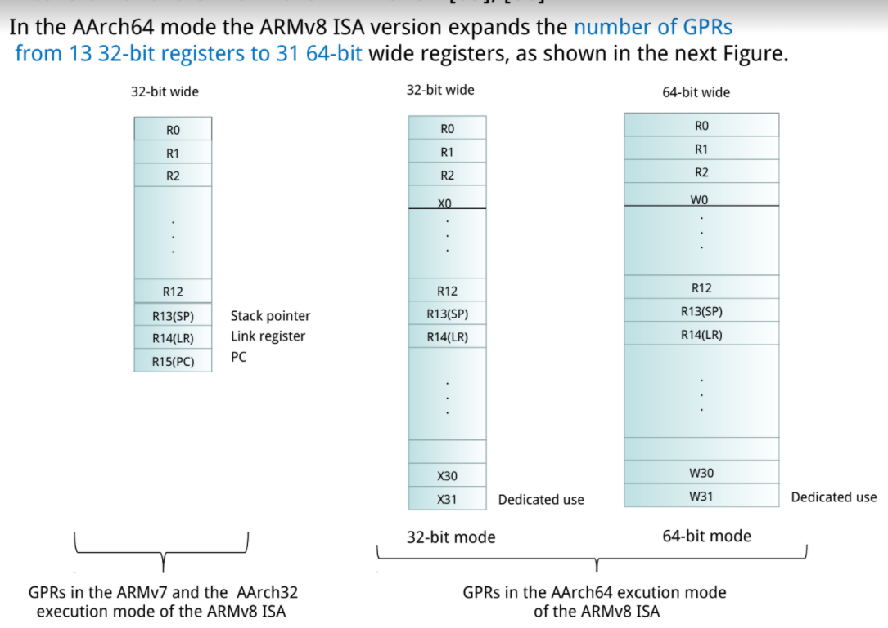
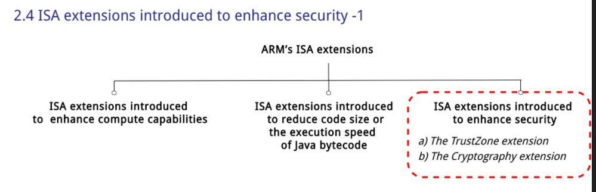

## MISC

[arm ISA](https://www.youtube.com/watch?v=SwqKJVhWZmA)

[document](http://hackfoldr.org/arm/)

[skymizer](https://www.youtube.com/watch?v=SwqKJVhWZmA), 一個complier最佳化的公司

[OPTEE](https://github.com/OP-TEE/optee_os)

[ARMv8](http://wiki.csie.ncku.edu.tw/embedded/ARMv8)

## Evolution of the ARM ISA

- ARM 共 8 種  ISA 版本 (也就是 ARMv1 ~ ARMv8)
- 最新的CPU於202104公布 [ARM V9](https://www.youtube.com/watch?v=HReASIbY5_I)。
- 其中 ARMv1  和 ARMv2 位址範圍只到 26 bits，自 ARMv3 開始則採用了 32 bits 位址範圍
- R13: Stack Pointer
- R14: Link Register
- R15: Program Counter
    - ARM 模式 (ARM state): bits [1:0] 未定義且會被忽略， bits [31:2] 保留了 PC 數值
    - Thumb 模式 (Thumb state): bit [0] 未定義且被忽略， bits [31:1] 保留了 PC 數值 (這是為了提升指令的密度, 客製化的instruction)

- 如上圖所示, 一個function call的時候的calling convention (see [AAPCS](https://www.cnblogs.com/Five100Miles/p/8458561.html))

### Structure of the ARM ISA

-  ARMv3 時候狀況就些許不同了，ARM v3 採用了 32-bit 位址匯流排(address bus)以及 32-bit的資料匯流排(data bus)，這種 32-bit CPU 架構一直延續到 ARMv7。
- ARMv7以後都以Cortex命名 (A, M, etc...)
- ARMv8 開始，CPU 架構則更改為 64-bit。

- arm a64可以定址空間為64-bit
    - 注意, 可以定址並不代表可以存取; 一般來說, address space會使用48-bit; 為了效率問題, 就使用48-bit + some window來表示 address space 
    - 詳見 [stack overflow](https://stackoverflow.com/questions/6716946/why-do-x86-64-systems-have-only-a-48-bit-virtual-address-space)
- 在ARMv8可以自行選擇A32/T32 or A64 ISA, 取決於授權

  

#### ARM ISA Extension

-  SIMD (Single Instruction Multiple Data) extension
   - 也就是 R0 ~ R12 這 13 個 32-bit 暫存器所組成，這項擴展自 ARMv6 引入
   - 效能提昇有限，自 ARMv7 後被 Advanced SIMD(也就是NEON 所替代掉)

Note:

    RISC/CISC今日的差異性並不大, 僅有在設計初始的概念有所差異; 事實上intel現今CPU就等同於高速RISC, 而ARM裡的SIMD, VFP又相當於RISC的指令在做的事

##### VFP (Vector Floating Point)

- 早期的 ARM 處理器並沒有負責處理浮點數運算的功能，因此浮點數的運算就必須透過 CPU 來進行處理
- ，為了解決這個問題，ARM 加入了 VFP  (Vector Floating Point)  這種透過協同處理器來輔助計算浮點數的應用
- VFP是透過Coprocessor的方式實作
- VFPv3/v4 的 VFP 暫存器變成 64 bit 暫存器
- NEON 指令集自 ARMv7 引入，為 64/128-bit SIMD (Single Instruction Multiple Data) extension

##### Extension of the GPRs in ARMv8 ISA

- AArch64: 在32/64bit ISA的GPRs定義

##### Security 

- TrustZone: 把特別的code跑在secure world
    - secure world: 專門安全用的 (Ex: 支付)
    - normal world: 普通系統用的
    - TrustZone HW確保normal world resource不能存取到secure world resource

#### Fast/Foundation Model

[arm simulation model](https://developer.arm.com/tools-and-software/simulation-models)

- ARM模擬CPU的IP
- fast model要錢; foundation model不用錢但很慢

