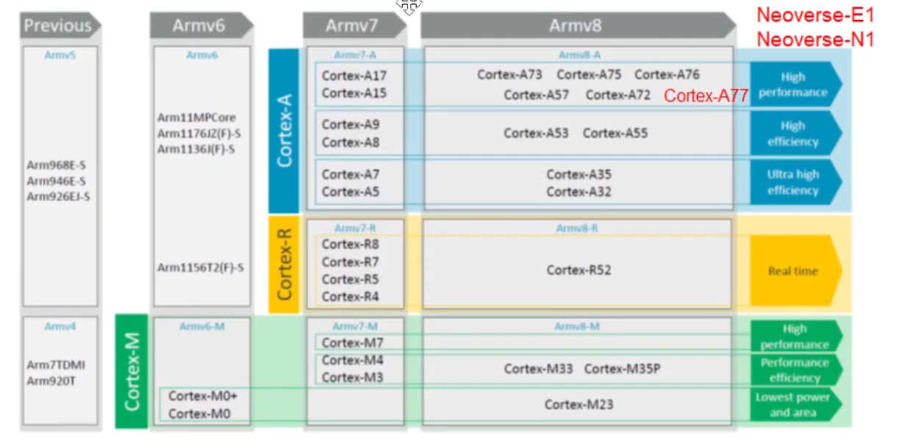

## MISC

[armv9微架構的特色與市場](https://www.youtube.com/watch?
v=kLT9UFUpsBk)

[ARMV9 CCA](https://www.ithome.com.tw/news/143658)

## ARM Micro-architectures V9 Brief

- Cortex-M0為V6版本; Cortex-M3/M4/M7為V7;
- Neoverse為server用的

- 增加向量運算 for machine learning
- DSP
- 改善security
- 和V8相容

### SVE (Scalable Vector Extension)

- 進化為SVE2 (128 bit --> 2048 bit for vector calculation)
- 讓ARM支援CUDA 加速

### CCA (Confidential Compute Architecture)

- ARMv9加入了機密運算架構, 對於
- 提供PSA (platform Security Architecture)
    - 對於IOT HW/SW/Devices的認證.
- 提供confidential DSP/ML
- 由ARMv6的trustZone延伸而來
- Realm: 機密領域, 把sercure/non-secure的執行環境獨立出來
    - 將會改變作業系統因被授與最高執行權限，而能看到與執行一切的現況。簡而言之，作業系統仍能決定哪些可執行，以及何時執行，但應用程式會坐落在記憶體隔離的硬體保護區域，與整個系統的其他部分隔開。