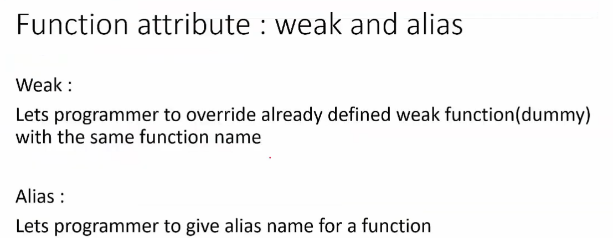

## MISC

[youtube for arm startup](https://www.youtube.com/watch?v=qWqlkCLmZoE&list=PLERTijJOmYrDiiWd10iRHY0VRHdJwUH4g&index=1)

## Build Process

### Cross Compliation and Toolchains

- 跨平台可以compile, assemble, 和link的binaries
- 提供target的debug binaries
- 目前ARM有提供兩種tool-chains
    - GNU for ARM embedded Processors (免費的)
    - ARM-CC: arm提供的, ships with KEIL, 需要licensing

以下為ARM-GCC的重要biaries

- arm-none-eabi-gcc: 不只complie, 還有assemble & link obj並且創造executable file
- arm-none-eabi-ld: 顯性呼叫linker
- arm-none-eabi-as: 將assembly code轉成machine code實際的執行檔

### Build

1. 經過preprocessor將macro展開/將conditional compile展開, 並將.c檔轉換成.i檔
2. 經過code generator產生.s file(assembly language), 這個過程稱為mnmeonics
3. 經過assembler產生.o file (relocatable object file), 此時還沒有絕對定址, 此時帶有的是relocatable address

- 以上這三步可藉由arm-none-eabi-gcc完成

4. 所有的.o檔都會藉由linker, 將所有的.o檔的section relocate, solve symbols, 並生成.elf file
5. 經過obj-copy, 將bin檔案dump出來

#### example build

- -c: just compile/assemble, 但是不要link
- -S: just compile, 輸出assembly file
- 上面代表assembler失敗, 因為沒有指定processed architecture (M0 or M4, etc..)
  

- -march: 選擇arm architecture; cortex-M4是選擇armv7ve

- -mcpu(same as mtune): 如果不知到用啥架構, 就可以使用該option

- mthumb: cortex M系列只支援thumb state

### Relocatable Object file

- .o檔為elf format
- ELF為GCC標準的 object files and executable files
- ELF描述了data/rodata/code/...的section的描述
- COFF為Unix System用的
- 如果用的是ARM-CC, 則會使用AFI format

#### example of objdump of .o file

- 可以發現dump .o檔案後的address都非絕對位址, 僅僅只是相對位址
- 再用linker scrip relocate MCU start address

## Startup File

- startup code -> main
- startup code為target dependent, 
    - 會包含vector table placement in code memory
    - initialize SP, etc...
    - turn some HW unit (Ex: FPU)
    - 初始化.data/.bss in SRAM

### basic startup file

基本要實現的3個ARM startup file

1. init vector table
2. init .data/.bss
3. jump into main()

#### vector table

- vector table描述了各interrupt handle時需要jump的memory

- vector table包含了system exception (for ARM CPU usage)和N個IRQs (根據CPU型號有所不同)

#### example vector table

- 利用attribute將vector table放置於.isr_vector section

- 可以看到多了一個.isr_vector section

- 多製造一個NMI_Handler
- 沒必要每個exception都處理 -> 使用alias解決

- weak: 給其他有定義的function來覆寫的
- alias: 讓function定義其他的function name

- 讓Default_Handler作為NMI_Handler的別名
- 所以NMI exception發生時, 就會跑到Default_Handler處理

- 使用weak, 讓其他層去implement各exception的handle

- 需要把存在flash的.data section copy到SRAM中, 此時就要知道.data section的boundary
- linker中會export _edata/_sdata/_etext等資訊

## Linker Scrips

