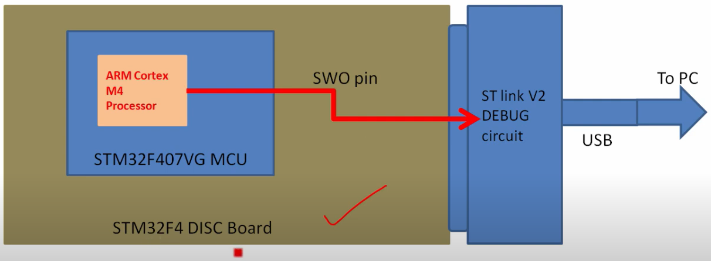
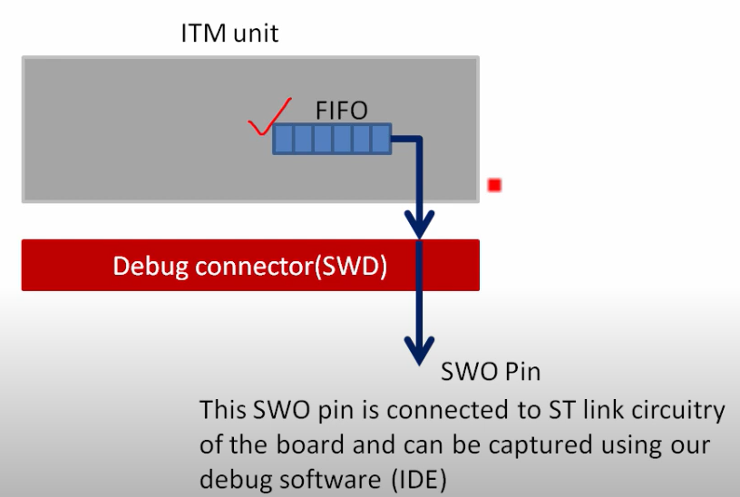
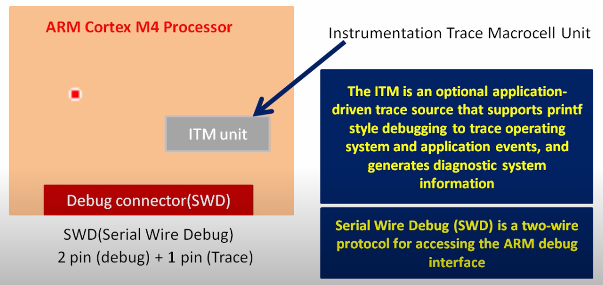

## GBD

### introduction

硬體需求： 兩台機器

- 一台為調適的linux (embedded linux）, 一台為執行gdb的client
- ggb為clinet-server架構, 被除錯端為gdb server

Note

    gdb-server不一定是"gdb", 只要實現gdb通訊協定就好

client-server可以為

- TCP/IP
- JTAG
- COMport

Linux kernel中內建kgdb, kdb(在linux kermel內, 但沒有使用到linux kernel的功能), 在linux當機時仍能運作

- 編kernel 計得把kgdb和kdb編進去
- linux debug 時, linux內的kgdb + kdb為gdb-sever
- kgdb和kgb通過硬體將資料傳出 （Uart, WIFI, etc...）

### MISC

- cgdb: colord gdb
- tui: 可以show出layout

## OpenOCD

### 網址

[openOCD and GDB](http://openocd.org/doc/html/GDB-and-OpenOCD.html)

[openOCD for Zephyr](https://github.com/zephyrproject-rtos/openocd)

### nrf52840 board

:::image type="content" source="image/debugger/openocd_with_nrf52.png" alt-text="setup":::

- 先將openocd for nrf52 board打通, 此時會
    - 自動開通telnet server port 4444
    - 自動開通gdb server port 3333
- 選定要使用的arm gdb tool
- 

#### MISC

- 參數  
    -f : 指定config file的路徑，如果沒有設定的話，OpenOCD預設會開啟openocd.cfg
    -d : Level數字-3~3，從LOG_LVL_SILENT(-3)~LOG_LVL_DEBUG(3)
        編按: 現在多了一個LOG_LVL_DEBUG_IO(4)的Level用來底層I/O除錯用
    -l : Log file的路徑，預設會直接打印在OpenOCD的console上，加上這個可以把log導向檔案中，方便除錯!

- 快速用openocd打通的blog:

https://blog.dbrgn.ch/2020/5/16/nrf52-unprotect-flash-jlink-openocd/

    openocd -c 'interface jlink; transport select swd; source [find target/nrf52.cfg]'
 

## pyOCD

## Debugger HW

### JTAG

### SWD

### DAPlink

## Arm Debug ITM (using printf/scanf)

在ARM Cortex M3/M4/M7中使用prinf輸出, 可以透過ARM選配的ITM (instrumentation trace macrocell)的SWO做trace 

ITM模組內會有FIFO, 並透過SWD介面把prinf資料從SWO輸出

    Note: 如果是cortex M0就要使用openOCD, 把printf的資訊透過SWD傳至GDB上

### ITM

這幾年 Cortex-M 系列的 ARM 微控制器大行其道, 在開發工具上也有一些使用上的調整:

以前的晶片除錯器 (debugger) 用的是 JTAG 介面標準, 可以多個 CPU/DSP 一起除錯. Cortex-M 則主推 SWD 介面, 一個 debugger 一次只能除錯一個 MCU 晶片. 以前 ITM 是標準配備, 現在則為選配.

SWD 介面還有另一個選配: SWO.
有 ITM 的晶片一般都可以繼續使用 JTAG 介面的除錯器. 有 SWO 功能則可以使用 trace tool 協助分析無法以單純設斷點可以找到的問題. 例如: STMicroelectronics 比較阿沙力, 所有 Cortex-M 系列的晶片都有內含 ITM, 也有 SWO 功能. 

- SWDIO + SWDCLK: two-wire protocol用來存取ARM debug interface的, 在ARM debug interface spec V5以後用來取代JTAG用
- SWO: ARM提供能夠支援MCU使用prinf/scanf的線

### Semihost

### SWO

### J-LINK RTT