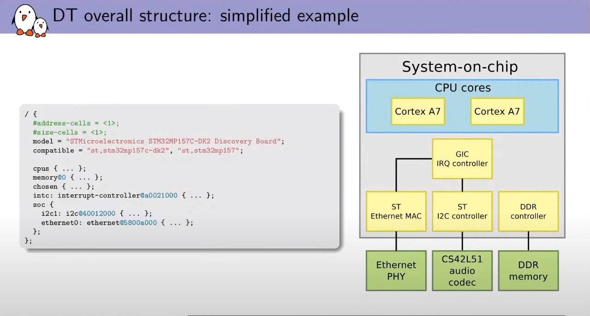
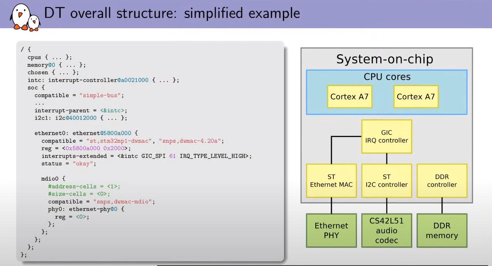
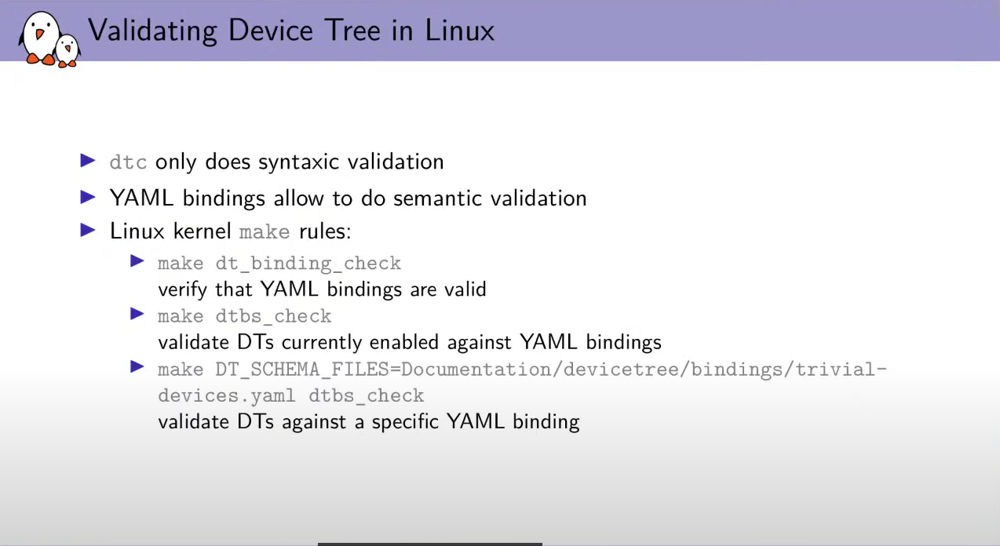

## device tree

### stm32f157f

- 

### Introduction

- 一般的embedded platform: CPU + peripheral
- DT: 用來描述hardware的語言

- dts: 描述硬體的語言
- dtc: compeilte DTS語言成DTB
- dtb: 可以被跨OS描述的硬體檔案, 不大, 但足夠讓OS了解HW topology 
- fdb: flatted device tree, 就是DTB; 主要是描述他已經被load到memory的特性 (失去tree形狀)

- 在u-boot之類的bootload可以直接bundled該blob
- 常見linux作法是將將dtb address傳入kernel指定的CPU address
- Ex: Arm32用boot-z, 需要帶入三個參數
    - ram address: kernel image load至RAM的address
    - init file system address: -
    - address of dtb
    - arm linux在boot時會根據R2的value (address of dtb)
    - 大同小異, 都是讓OS to retieve the dtb from the firmware
- dtb在bootloader載入前都能被patch掉
- libfdt: 解析DTB的工具

#### example with STM32MP1571-DK1

- TF-A: arm trusted firmware

- 

### discoverability

- 事先不用預知裝置的peripheral
- 可以透過讀vendor id/chip id去enum device
- 像是PCIE和USB
- I2C/Uart/SPI就沒有discoverability, 亦即需要事先config, 而非dynamically discoverible

- 利用device描述語言讓OS/bootloader知道HW資訊(board level information)
- 

- ARM/x86: 使用ACPI描述non-discoverable的裝置
- Linux: 使用device tree描述硬體裝置, 現今porting Device Tree在linux上很重要

### device tree source

- 描述語言稱為device tree source (.dts)
- 經過compile (dtc)後生成dtb(blob)
- DTB可以
    - 直接被bootloader linked
    - Ex: 現在如果在arm linux platform boot, 會
        - boot from u-boot bootloader
        - use bootset to takes the kernel address (where the kernel image has been loaded into ram and device tree blob address) so the OS are able to access the DTB and able to recognize what hardware is abailable and how it is organized

#### syntax

- tree of nodes
- property_value: 可以為int or array or string etc.
- node用來描述one device or IP block
- properties用來描述device characeristics

#### example

- compatible, address-cells, size-cells
- 
- 

- CPU0: 用來做label; 可以被其他node properties reference到 (使用phandle)

- 只有一個property: device_tpye = "memory"
- reg: base address + size
- chosen: 讓fw or bootloader能夠傳遞extra information給OS (which is not exactly HW description, 像是傳遞kernel command line)

- soc: 比較重要的部分; name會因platform而有所差異, is not specified by DTS
- <&intc>: 就是phandle的寫法

- DT mimics the topoligy of the hardware
- Ex: eeprom: 一個連接在I2C上的eeprom, 所以排在i2c的sub-node
- i2c底下還掛載著cs42151的audio codec; 其中4a代表其audio codec

- mdio bus: 

#### DTS inheritance

- 還沒有制式保存DTS的地方

- DTS file被非monolithic (可以被拆分成許多檔案, 讓他可以被重複使用)
- dtsi(include): include file for other DTS file; DTC只能吃DTS檔案, 但DTS可以include任何的DTSI
- DTSI contains the definition of what is inside the system on chip; 再讓所有的DTS board definition去include DTSI
- DTS 內容為贏過#include DTSI的內容
- 用#include

- 應該描述HW, 而非configuration
    - ex: 精確描述audio codec連接到哪, 而非選用了audio codec的什麼mode
- 要是跨OS的
- 並非描述hw detail

##### example of AM33cc

- 右邊的DTS會覆蓋DTSI相同的設定;
- 右邊的DTS會加入DTSI沒有的設定
- 這只是描述compiled後DTS會有的長相, 事實上編出來會是DTB file

- 直接使用@uart0做phandle覆蓋是linux目前prefered的做法

##### example of STM32MP157A SoC

- DTSI: 描述了SOC; 該stm32mp157.dtsi描述了stm32mp157 soc
- DTS: stm32mp157a-dk1, 描述了board level for this board
- 後面DTS的會贏DTSI裡面的attribute

- SoC: 描述了system information
    - mp151: 比較low level的SOC
    - mp153: 就是151 + 更多的pheripheral
    - mp157: 加上GPU + 更多interface
    - crypto: 選配的, 所以獨立出來
    - pinctrl: 就是pin
    - 還有不同package的dtsi
- Board: dk1和dk2 platform DTSI
    - dk1和dk2就差在有沒有crypto

#### Spec

- device tree spec: 用來描述top level what they are contain common properties, 為foundation
- device tree bindings: 描述了該hardware在device tree中應該要有什麼properties. 所以提供C code/driver外, 也得提供該HW的device tree bindings

##### example

- 舊的手寫方式

- 新的YAML描述
- 比較好讓程式parsing

### Building Device Tree in Linux

- 使用DTC就能邊DT

- DTC只會做語法檢查, 但使用了YAML可以做語義上的檢查
    - ex: 在已知的binding上去檢查是否有正確的properties和value
    - see [example (1)](#example-1)

- dt_bindings_check: 看查yaml是否正確及是否make sense
- dtbs_check: 看是否build出來的dtbs有違背bindings
- 協助檢查一些typo的錯誤

### Exploring the DT on the target

- 在linux上可以run time用DTC去檢查現在使用的device tree

### Run time modify

- 可以動態改DT
- 但實際上只有很少的部分可以被修改
- 用一些command在u-boot上操作

### Compatible Property

- the uniquely identifier to know what this node is representing as a hardware platform and so which device tree binding you rely on to represent this particular piece of hardware
- device tree spec描述了該uniquely identifier要使用的programing model (bunch of registers, bit field meansing to control IP block )
- 並讓OS能夠找到適當的driver
- the compatible string is going to be the key to associate a node in the device tree with in linux kernel
- regulator-fixed和gpio-keys沒有vendor,model 
- simple-bus: 特殊value

- linux用compatible用來尋找相對應的device driver
- 用table將device <-> driver match在一起

#### Example of Compatible Property

- platform_driver基本的struct
- .driver.of_match_table: 他match的compatible string是那些
- 若DTS node裡面有其中stm32_match裡面描述的string, this node and the platform device that created based on that informatoin will be tied with that platform driver and the probe function is gonna be called

### Reg Property

- 不同type會有不同的reg property的意義
- Memory-mapped: 表示該HW可以不同的memory address area

- 對於i2c而言, 是I2c bus address

- 對於SPI而言, 是CS number
- node name後面的@address必須要符合第一個reg的第一個entry

### Cells

- 32bit value就成為一個cell

- #address-cells = <1>: 表示之後的child node需要一個cell表示address
- #size-cells = <1>: 表示之後的child node需要一個cell表示size
- child node裡面可以再覆寫一次該cell特性

### status property

- OK才代表有在用
- bare-board device才會將其enable

### interrupt description

- interrupt-extended: improved way to combine two information

### other resources

### -name property

- 和resource binding

### pin muxing description

- 描述board上應該要用的pin mux

- 

