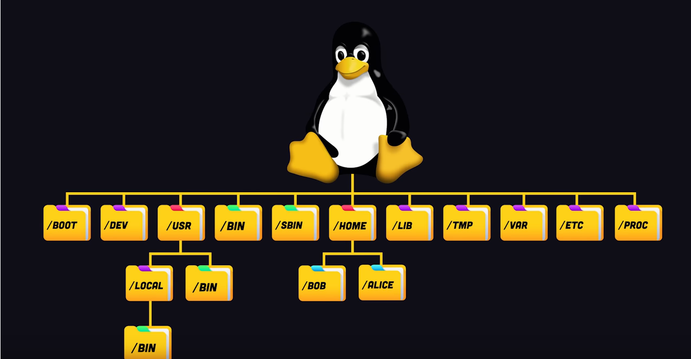
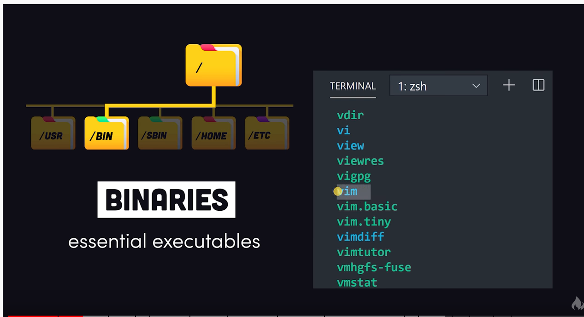
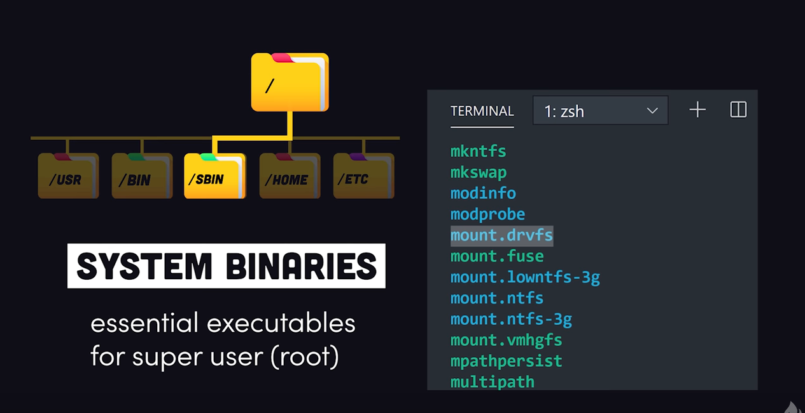
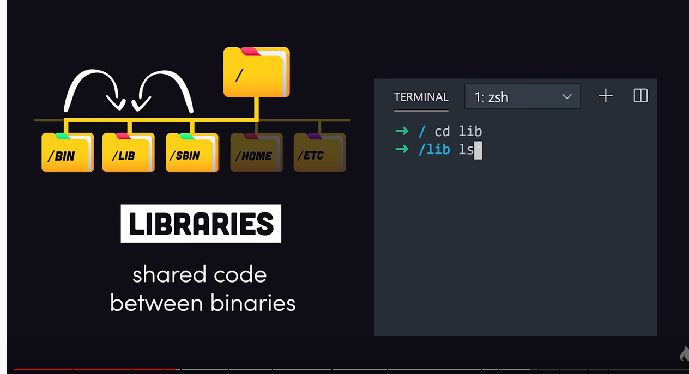
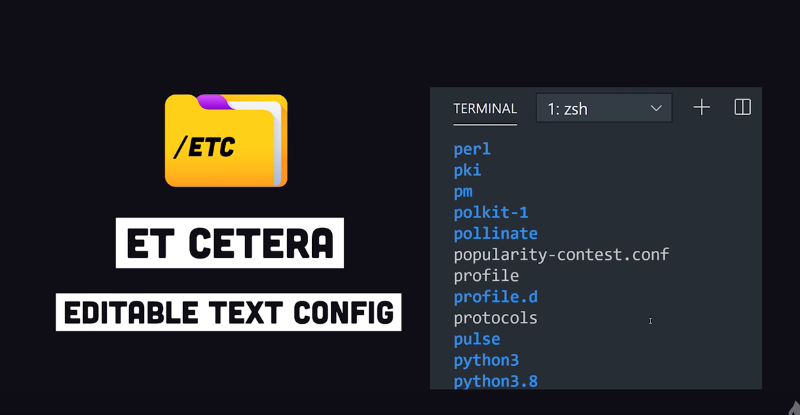
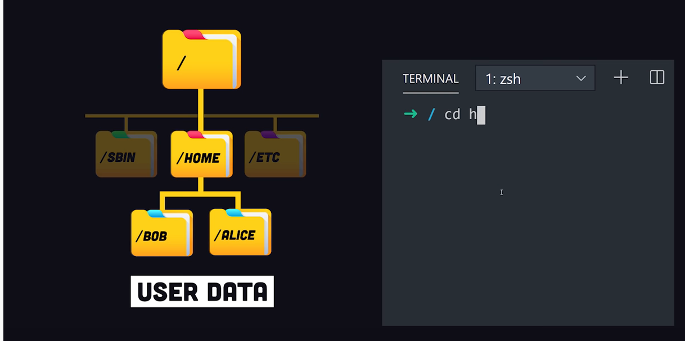
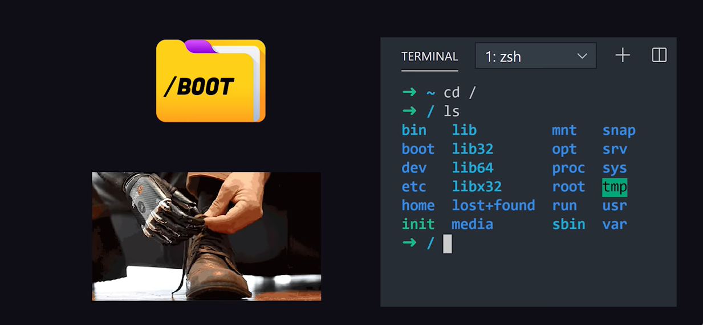

## Build

### Kconfig

### Ninja

### Device Tree Complier (DTC)

### Gn build system

## File System Hierarchy

### BIN

- essenial executables file
- 一些可以在任何路徑下的command line執行的檔
- OS必備的檔案
- 像是cat、cp、chmod df、dmesg、gzip、kill、ls、mkdir、more、 mount、rm、su、tar

### SBIN

- 只能被root user使用的檔案
- OS必備的檔案
- fdisk、dhcpcd、dump、e2fsck、fdisk、halt、ifconfig、ifup、 ifdown、init、insmod、lilo、lsmod、mke2fs、modprobe、quotacheck、reboot、rmmod、 runlevel、shutdown

### LIB

- 被lib和slib共同使用的檔案

### USR/BIN

- 並非OS必備的檔案; 偏向App層的
- c++、g++、gcc、chdrv、diff、dig、du、eject、elm、free、gnome*、 zip、htpasswd、kfm、ktop、last、less、locale、m4、make、man、mcopy、ncftp、 newaliases、nslookup passwd、quota、smb*、wge

### USR/LOCAL/BIN

- local可以manual compile的SW
- 使用者放置自己的可執行程式的地

### etc

- config file存放的地方

### home

- 使用者資料夾

### boot

- linux kernel boot up使用的資料夾

### dev

- 裝制與週邊都以file型式存放

### opt

- 這裏可以用於放置第三方大型軟件（或遊戲）

### var