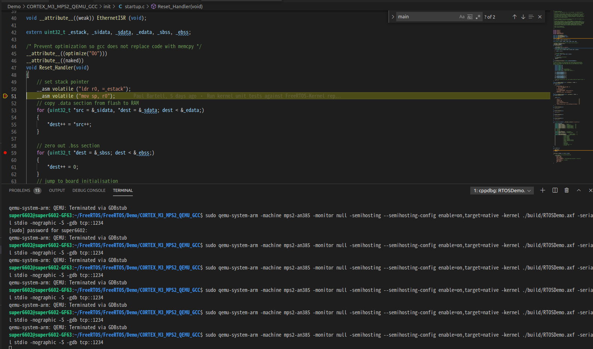
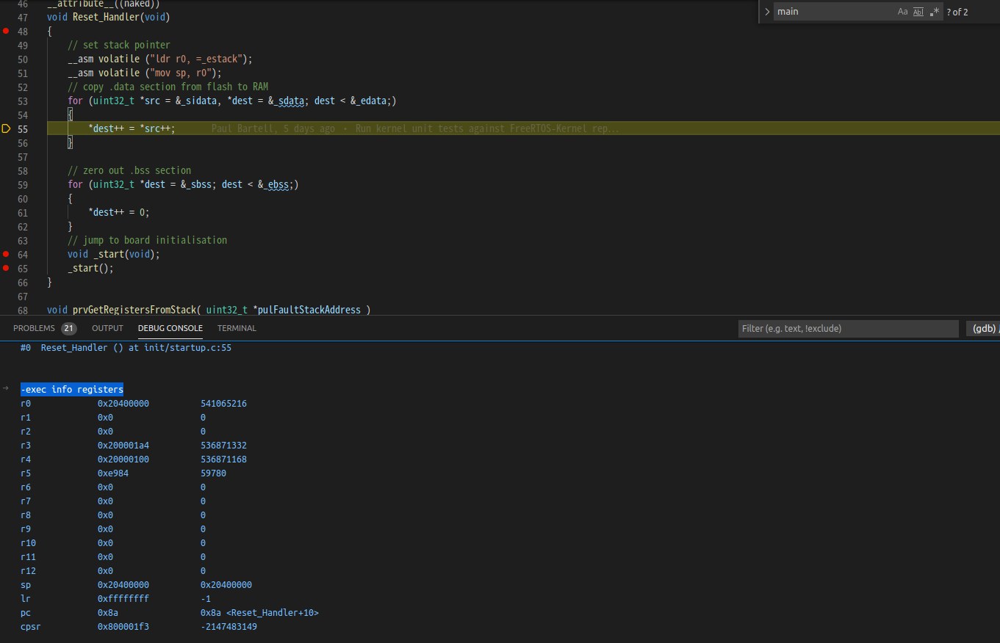

## MISC

[qemu + stm32](https://blog.csdn.net/BLUCEJIE/article/details/114802463)

[freertos on qemu](https://github.com/FreeRTOS/FreeRTOS/tree/master/FreeRTOS/Demo/CORTEX_M3_MPS2_QEMU_GCC)

### MISC Commands

1. 
qemu mount and start a GDB server

    sudo qemu-system-arm -machine mps2-an385 -monitor null -semihosting --semihosting-config enable=on,target=native -kernel ./build/RTOSDemo.axf -serial stdio -nographic -S -gdb TCP::1234


``` json
{
    // 使用 IntelliSense 了解相关属性。 
    // 悬停以查看现有属性的描述。
    // 欲了解更多信息，请访问: https://go.microsoft.com/fwlink/?linkid=830387
    "version": "0.2.0",
    "configurations": [
        {
            "name": "(gdb) 启动",
            "type": "cppdbg",
            "request": "launch",
            //我们的的STM32程序的路径，也可以是绝对路径
            "program": "${workspaceFolder}/Demo/CORTEX_M3_MPS2_QEMU_GCC/build/RTOSDemo.axf",
            "args": [],
            "stopAtEntry": false,
            "cwd": "${workspaceFolder}",
            "environment": [],
            "externalConsole": true,
            "MIMode": "gdb",
            //你的arm-none-eabi-gdb的安装路径
            "miDebuggerPath": "/opt/gnuarmemb/bin/arm-none-eabi-gdb",
            //在本机调试一般是localhost:端口号
            //如果程序运行在另一台电脑或者开发板（在嵌入式linux调试中经常遇到）可以是
            //ip:端口号，例如：192.168.1.123：3333
            "miDebuggerServerAddress": "localhost:1234",
            "setupCommands": [
                {
                    "description": "为 gdb 启用整齐打印",
                    "text": "-enable-pretty-printing",
                    "ignoreFailures": true
                }
            ]
        }
    ]
}

```

如下圖所示




2. 在vscode gdb鍵入-exec就能夠執行gdb commands

以下是show cortex M3 registers

    -exec info registers



