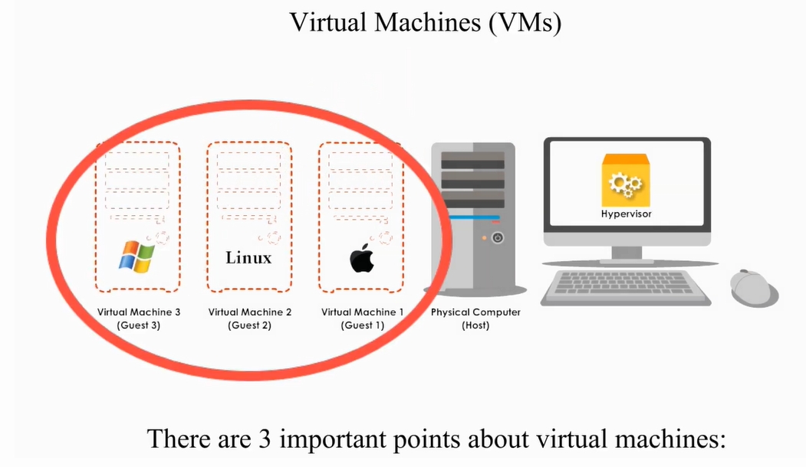
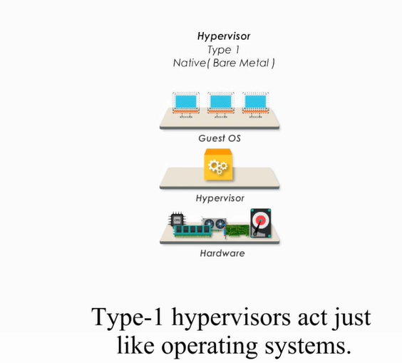
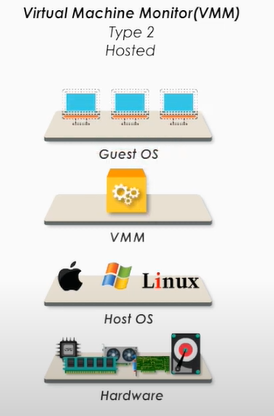
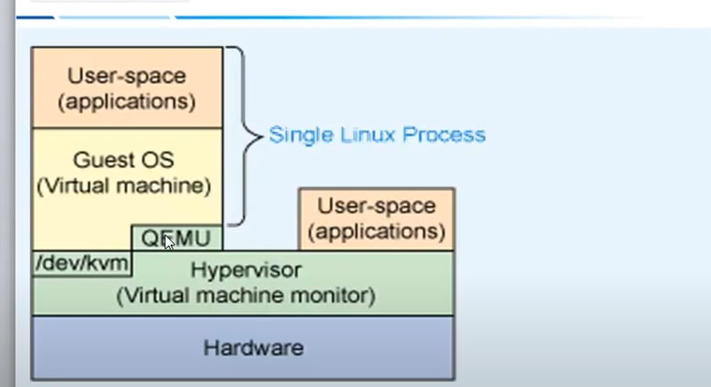
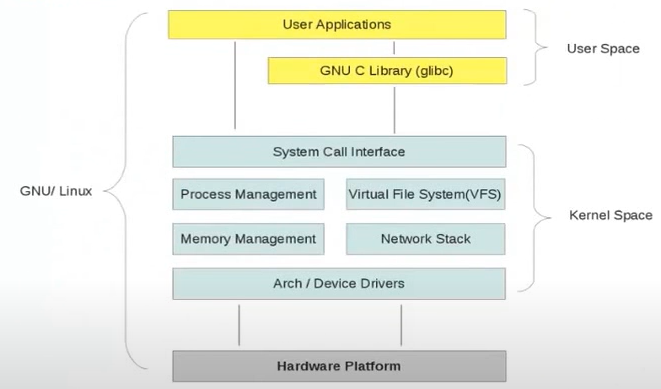

## MISC

[虛擬化技術](https://www.youtube.com/watch?v=yzC0BfoPybA&t=1418s)

[kvm](https://www.youtube.com/watch?v=Nruki-Uhi84&list=PLkuKHvw9NmzQkMk9yJHAxQLKMQTBVp_KW&index=3)

[VM and Hypervisor](https://www.youtube.com/watch?v=ISwgVUPH1cs)

[slide](http://hackfoldr.org/arm/https%253A%252F%252Fhackmd.io%252Fs%252Frk4TB4SX-)

[dynamiciq](https://www.cool3c.com/article/124149)

## Introduction

主要兩種分類

1. system virtual machine: 模擬整個CPU, 從CPU, bus, 周邊, etc..
   - virtual box
2. process virtual machine
   - java

### Motivations to enable virtualization

Virtualization:

- 把硬體的特性包裝起來
- 在伺服器已經用很久
- like EDA tool 使用

## Virtualization

- Host: 有實體硬體的電腦
- Hypervisor: 使用SW在HW上創建Virtual Machine
- Guest: Guest

1. 只要Host resource足夠, 就能夠創造足夠的Virtual Machine
2. VM在host硬碟裡就僅僅是個檔案; 對於guest來說就像是一個正常的OS

### Hypervisor Type

#### Type1

- hypervisor直接Run在HW之上, 所以被稱為bare metal
- 利用hypervisor可以直接控制硬體; 此時hypervisor就像是OS
- Xen, Hyper-V, KVM

#### Type2

- Virtual Machine Monitor
- 就像是APP run在Host OS之上
- 由VMM創建與管理virtual machine
- VMware, VirtualBox

## KVM

- KVM是linux kernel模塊
- QEMU: 軟體虛擬化CPU的技術; 讓KVM和QEMU協同合作

- linux不允許User Space操作HW; 利用system call操控硬體
