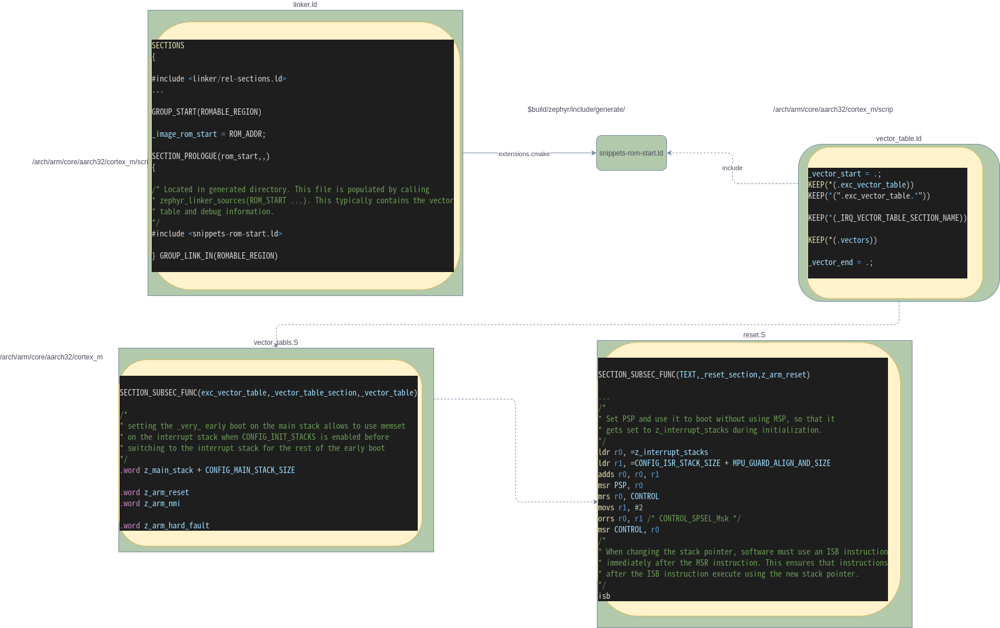
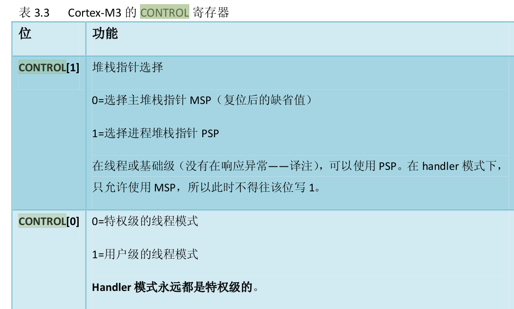

## MISC


[如何運行到main](https://lgl88911.gitee.io/2018/04/07/Zephyr%E5%A6%82%E4%BD%95%E8%BF%90%E8%A1%8C%E5%88%B0main/)

[context switch to main](https://lgl88911.gitee.io/2018/11/05/Zephyr-OS%E5%86%85%E6%A0%B8%E4%B8%8A%E4%B8%8B%E6%96%87%E5%88%87%E6%8D%A2%E7%AE%80%E8%BF%B0/)

## Question

- XIP startup Code ?

## GCC/ARM Assembler

在C code中可以定義Assembler attribute, 詳見 gnu_assembler.pdf

- 在GNU中, 如果希望引入instruction可以加個 '.'

### Generalities

- '@': 以後是comment, 不過不好讀
- '.’ and ‘_’是special characters
    - .xxxx代表是label
    - 
- '$': 代表immediate value

### Memory management

- .align n: 幾bytes align
- .ltorg?
- .word exp1 {,exp2}{,...}: for 32-bit reservations.


### Miscellaneous

- .type: 允許提供額外資訊給symbol (for debug usage)
    - 最常用的是 **.type symbol,%function**, 代表symbol是procedure entry
- .global: that symbol is shared with other symbols of the same name during link editing
- .weak: This means that another definition of the symbol will have a higher priority than this typed declaration.


## Linker

- KEEP 指令保留某個符號不要被 garbage collection, 例如我們不希望 ARM 的 ISR vector 會被優化掉。

Ex:

``` cpp

.text :
    {
        KEEP(*(.isr_vector))
...
    }

```

## Startup Code

### MISC

- SECTION_SUBSEC_FUNC(exc_vector_table,_vector_table_section,_vector_table): _vector_table為一個label，該leble屬於exc_vector_table區段中的_vector_table_section 子區段。我们可以简单地将 SECTION_SUBSEC_FUNC() 理解为实现了一个函数


### startup code linker



1. linker.ld中的section是build code時生成, 如上圖所示的snippet-rom-start.ld
2. build code會在build dir裡生成snippet-rom-start.ld; 此時scrip會根據選行的cpu找對應的vector_table.ld (和vector_table.S)
3. vector_table.ld就會定義section ".ext_vector_table"區段; 該區段是定義在vector_table.S
4. vector_table.S的ext_vector_table會定義stack + reset_handler + other exception; 其中reset_handler為z_arm_reset(定義在reset.S)
5. reset.S就會開始初始化 (基本會初始化PSP), 如下圖所示:



### prepare C startup

``` cpp

void z_arm_prep_c(void)
{
	relocate_vector_table();
#if defined(CONFIG_CPU_HAS_FPU)
	z_arm_floating_point_init();
#endif
	z_bss_zero();
	z_data_copy();
#if defined(CONFIG_ARMV7_R) && defined(CONFIG_INIT_STACKS)
	z_arm_init_stacks();
#endif
	z_arm_interrupt_init();
	z_cstart();
	CODE_UNREACHABLE;
}

```

1. 接著跑到C的初始化; 作.data/.bss/stack/interrupt的Initial

#### z_cstart

``` cpp
FUNC_NORETURN void z_cstart(void)
{

#if defined(CONFIG_MULTITHREADING)
	/* Note: The z_ready_thread() call in prepare_multithreading() requires
	 * a dummy thread even if CONFIG_ARCH_HAS_CUSTOM_SWAP_TO_MAIN=y
	 */
	struct k_thread dummy_thread;

	z_dummy_thread_init(&dummy_thread);
#endif

	/* perform basic hardware initialization */
	z_sys_init_run_level(_SYS_INIT_LEVEL_PRE_KERNEL_1);
	z_sys_init_run_level(_SYS_INIT_LEVEL_PRE_KERNEL_2);

#ifdef CONFIG_MULTITHREADING
	switch_to_main_thread(prepare_multithreading());
#else
    ...

```

- prepare_multithreading 會做thread的initial
- switch_to_main_thread會把thread切到bg_thread_main

##### bg thread

``` cpp
static void bg_thread_main(void *unused1, void *unused2, void *unused3)
{
	ARG_UNUSED(unused1);
	ARG_UNUSED(unused2);
	ARG_UNUSED(unused3);

	z_sys_post_kernel = true;

	z_sys_init_run_level(_SYS_INIT_LEVEL_POST_KERNEL);

	boot_banner();

	/* Final init level before app starts */
	z_sys_init_run_level(_SYS_INIT_LEVEL_APPLICATION);

	z_init_static_threads();

	extern void main(void);

	main();

	/* Mark nonessenrial since main() has no more work to do */
	z_main_thread.base.user_options &= ~K_ESSENTIAL;

```

1. 初始化POST_KERNEL驱动
2. 初始化APPLICATION驱动
3. 初始化静态thread
4. 跳到main函数执行(这里的main就是app的main函数)

##### low level driver

``` cpp
	/* perform basic hardware initialization */
	z_sys_init_run_level(_SYS_INIT_LEVEL_PRE_KERNEL_1);
	z_sys_init_run_level(_SYS_INIT_LEVEL_PRE_KERNEL_2);
```    

Zephyr的驅動等級一共分四種

1. PRE_KERNEL_1
2. PRE_KERNEL_2
3. POST_KERNEL
4. APPLICATION
   
PRE_KERNEL_1&PRE_KERNEL_2叫做low level driver

### Context Switch to Main

#### z_kernel member

``` cpp
struct k_thread {

struct _thread_base base;

/** defined by the architecture, but all archs need these */
struct _callee_saved callee_saved;

/** static thread init data */
void *init_data;

void (*fn_abort)(struct k_thread *aborted);

/** resource pool */
struct k_heap *resource_pool;

/** arch-specifics: must always be at the end */
struct _thread_arch arch;
};

```

#### _ready_q

``` cpp
struct _ready_q {
#ifndef CONFIG_SMP
	/* always contains next thread to run: cannot be NULL */
	struct k_thread *cache;
#endif
	sys_dlist_t runq;
	...
};
```
- ready_q: 為下一個要run的thread


#### 

``` cpp
char *z_setup_new_thread(struct k_thread *new_thread,
			 k_thread_stack_t *stack, size_t stack_size,
			 k_thread_entry_t entry,
			 void *p1, void *p2, void *p3,
			 int prio, uint32_t options, const char *name)
{
	char *stack_ptr;


	
```