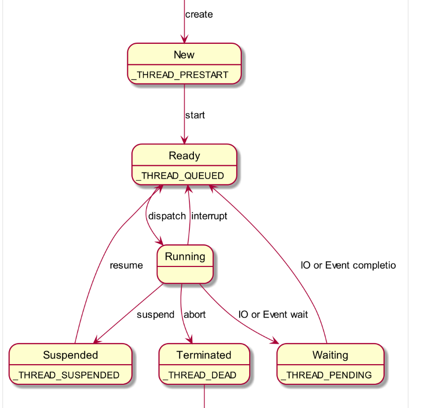
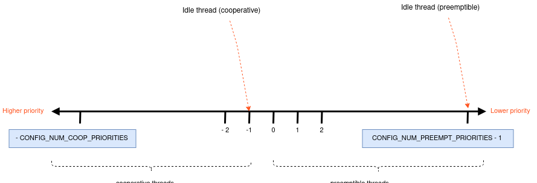

## MISC

[zephyr 舊版中文](https://zephyr-doc.readthedocs.io/zh_CN/latest/index.html)

[zephyr kernel service](https://docs.zephyrproject.org/latest/reference/kernel/index.html?highlight=kernel#)

[zephyr thread ](https://l2h.site/2019/11/16/20191106-Zephyr-Thread/)

### Thread Brief

- 沒有monitor/process/thread的區分, 所有可調用執行單位都是thread
- 每個thread都走自己的thread message和thread ID

- New: 新的thread創建
- Ready
- Waiting: 等待某種IO資源
- Running: thread執行中
- Suspended: 非等待資源的原因背停止
- Terminated: thread退出

- priority的數字愈小, 優先級愈高
- 分為兩類
    - Cooperative thread: 一旦開始執行, 除非中斷或是自行讓出CPU, 否則會一直執行 (像是python task)
    - preemptive thread: 一般的thread, 可以背高優先級的thread強佔
- 預設Cooperative thread是小於0的priority
- thread運行中, 可以改變其priority

| 屬性            | 說明                                     |
| --------------- | ---------------------------------------- |
| K_ESSENTIAL     | 核心thread, 不可以取消或退出             |
| K_SSE_REGS      | X86獨有                                  |
| K_FP_REGS       | 是否使用FPU                              |
| K_USER          | 是否為user thread                        |
| K_INHERIT_PERMS | 對user thread有效, 是否繼承parent thread |

### Characteristic

每個thread除了create時會assign thread ID外, 還會包括

- stack: 
- thread control block 
- entry point function, 帶3個arguments
- scheduling priority
- thread options: 特別的thread option
- start delay: 多久後才要start thread
- execution mode: user or privileged mode

### Life Cycle

- thread必須先create才能使用; kernel會initialize TCG和thread 尾部
- K_NO_WAIT: 代表create後直接run
- 被delay啟動的thread, kernel可以取消
- thread啟動以後就會執行下去; 在thread entry function內沒有while loop run直接return的話, 稱為***termination***
- 被terminate的thread要自行釋放shared memory (mutexes)

#### Abort/Join/Terminate/Suspend

- 讓A thread被B thread喚醒, 此時就能使用k_thread_join. 想要說的可以call k_thread_join, 此時會等到
    - 1. timeout
    - 2. target-thread(B) self-exits
    - 3. target-thread(B) abort

- 一旦thread被terminate, kernel就會將thread struct釋放
- 在thread terminate時, 藥用k_thread_join or k_thread_abort來sync thread termination?
- 可以call k_thread_abort()終止thread; 不過應該要向要被結束thread send signal, 讓該thread自己terminate

Note:

    abort不會回收共用資源

- suspend的thread要等另一個thread resume
  
Note:

    可以用k_sleep()指定thread睡眠

