## MISC

[ArmCoreSight](https://www.youtube.com/watch?v=dVBJC51XPts&list=WL&index=1&t=701s)

## Introduction

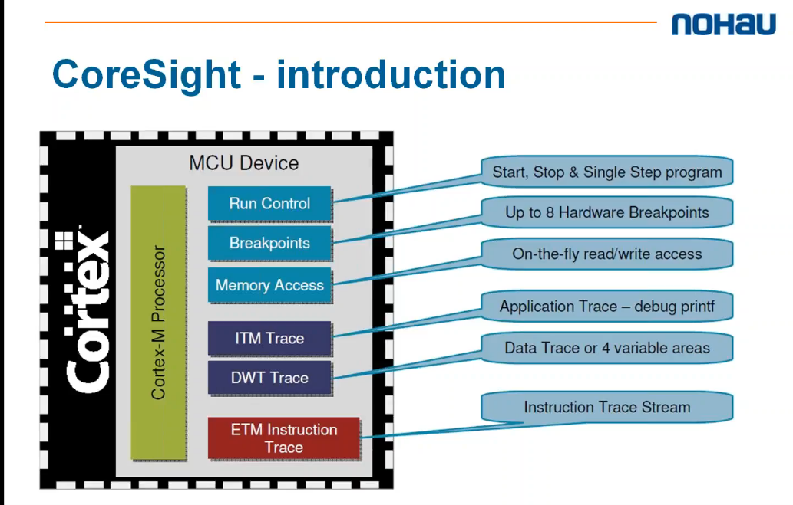

- Arm裡面的debug IP

### level1 Real-Time Debug

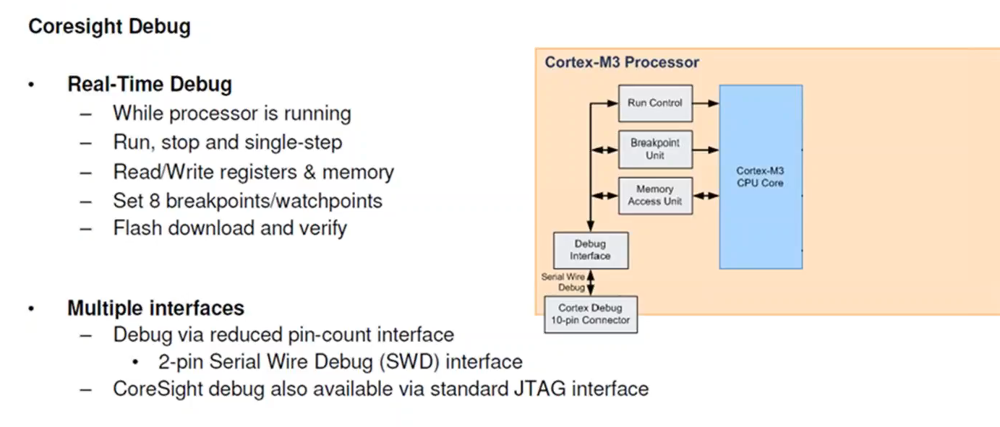

- 使用JTAG(20 pin)/SWD(2 pin) interface
- 可以做到
    - control step work
    - break point
    - memory access unit

### level2 - Data Trace

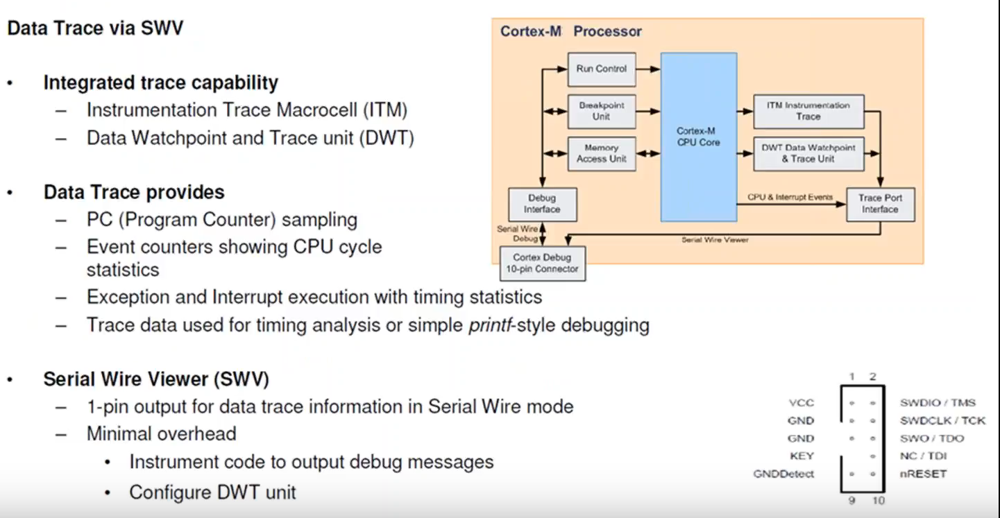

- Data Trace
    - 分為DWT和ITM模組
    - 紀錄PC, event counters, 和interrupt的timing statictics (output to SWD, SWDCLK)
    - Trace Data使用printf來debug (output to SWO)

#### ITM

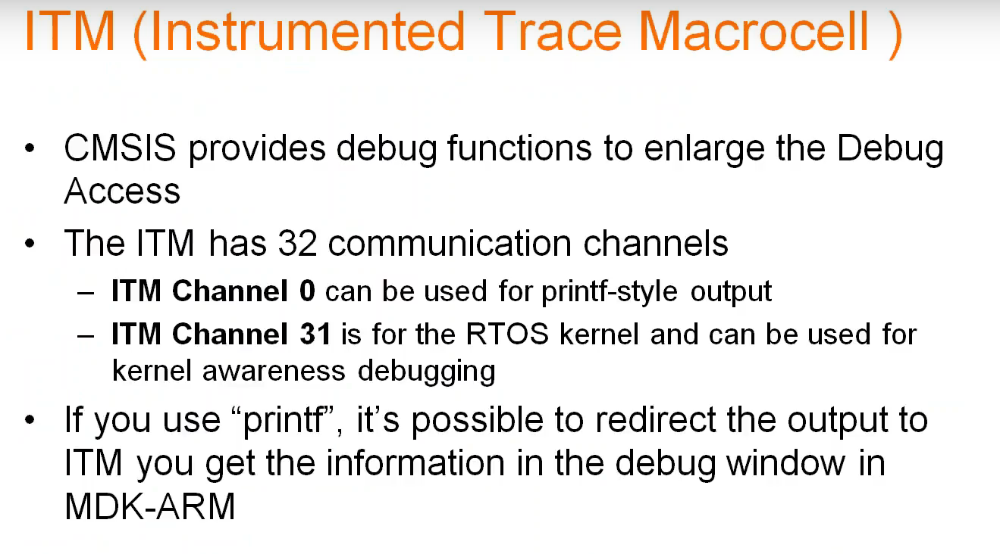

- ITM模組是ARM選配的
- 使用SWO pin output
- ITM channel 0/31式預設頻道
- ITM 1~30是user define

### level3 - Instruction Trace(ETM)

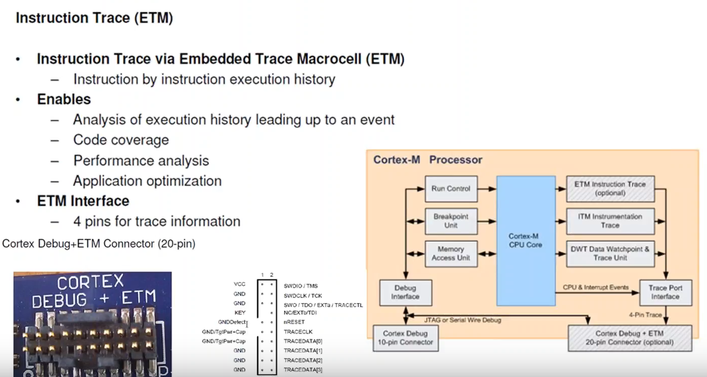

- 2 pins debug (TMS, TCK)
- 4 pins for Trace (TRACEDATA[3~0])
- 可以解析所有的assembly code, 和C/C++ code的執行時間
- 也可以看if/else的executed
- 能夠仔細分析所有application function的執行佔比

## Keil Usage

### Level1

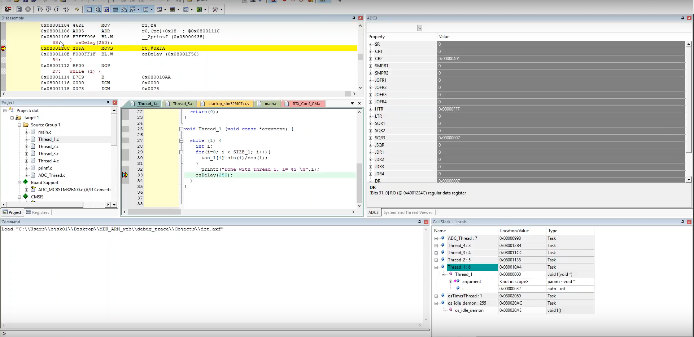

- 一般的register/peripheral/memory access control
- step in/out控制
- 斷點設置

### Level2

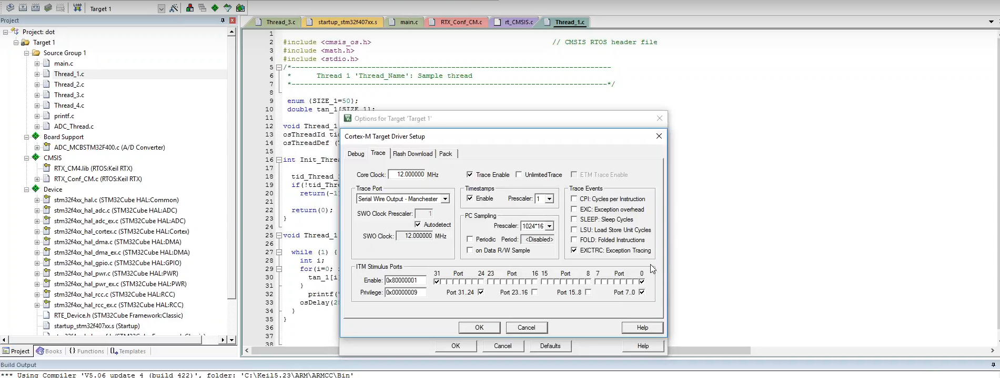

- 把Trace Enable

#### printf view

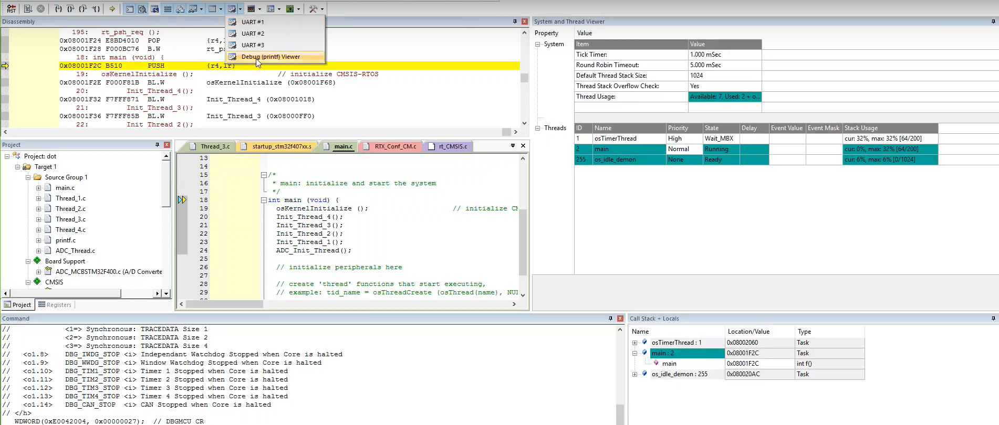

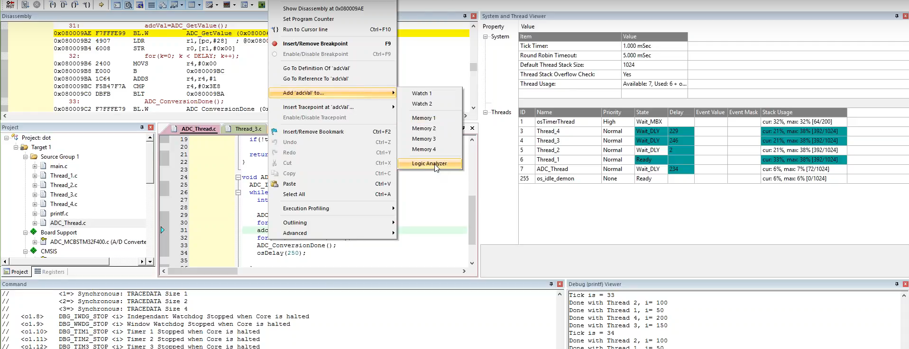

- 可以將variable輸出至LA上面顯示

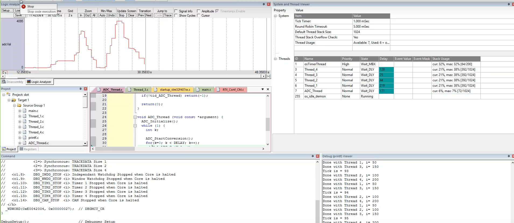

- 結果如上圖

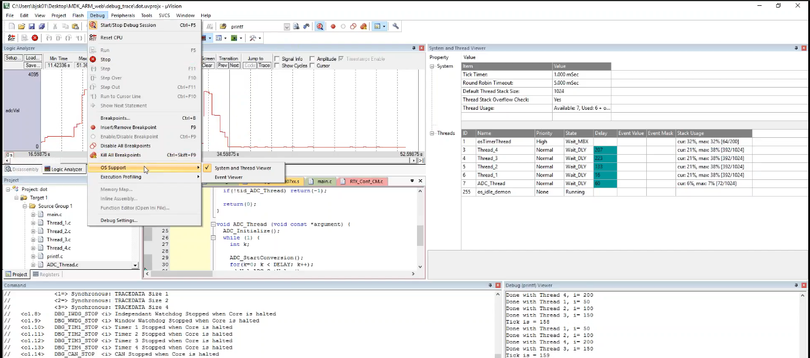

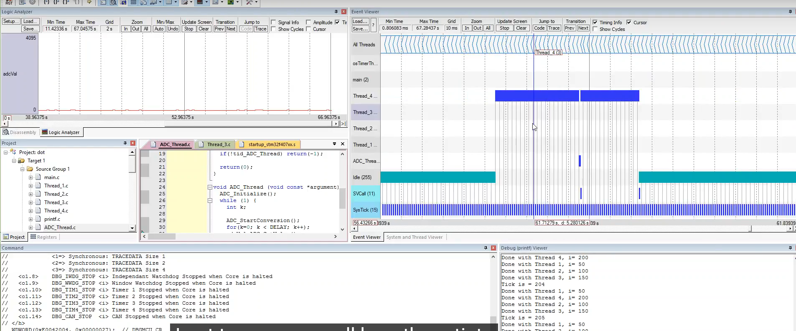

- 把thread的資訊也吐出來

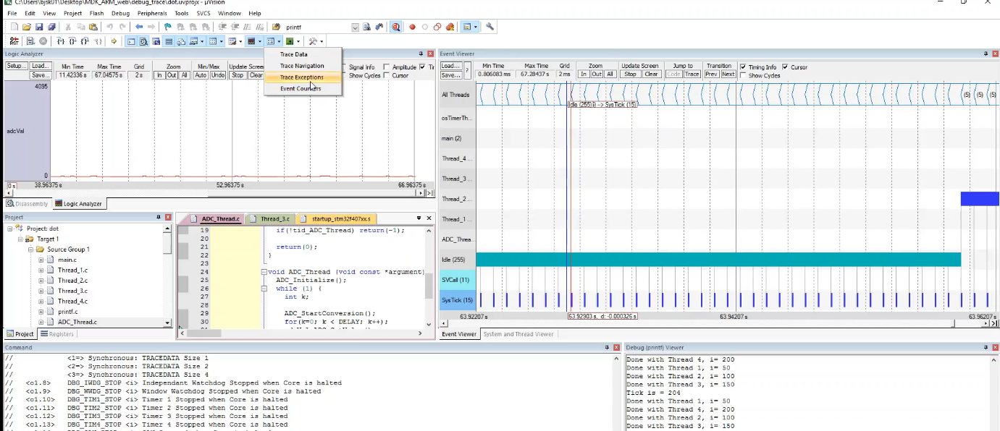

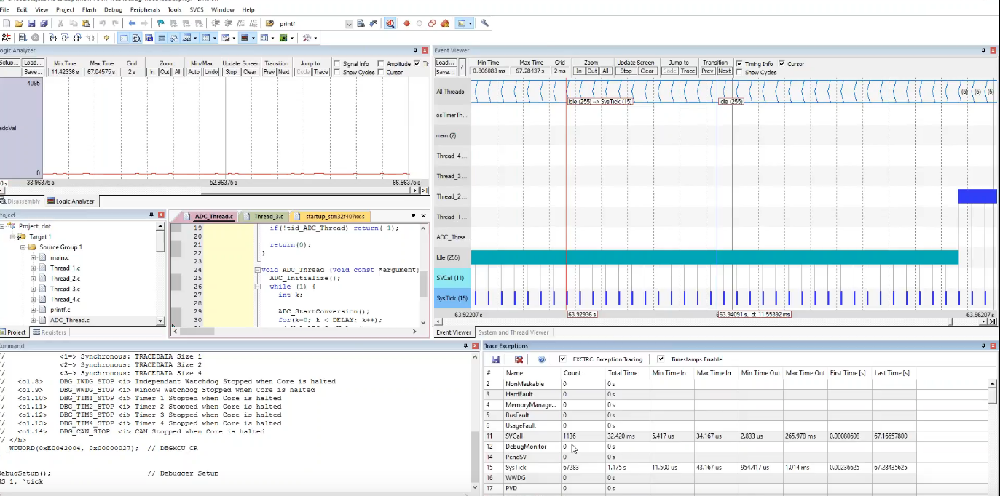

- 看exception的次數和執行時間

### Level3

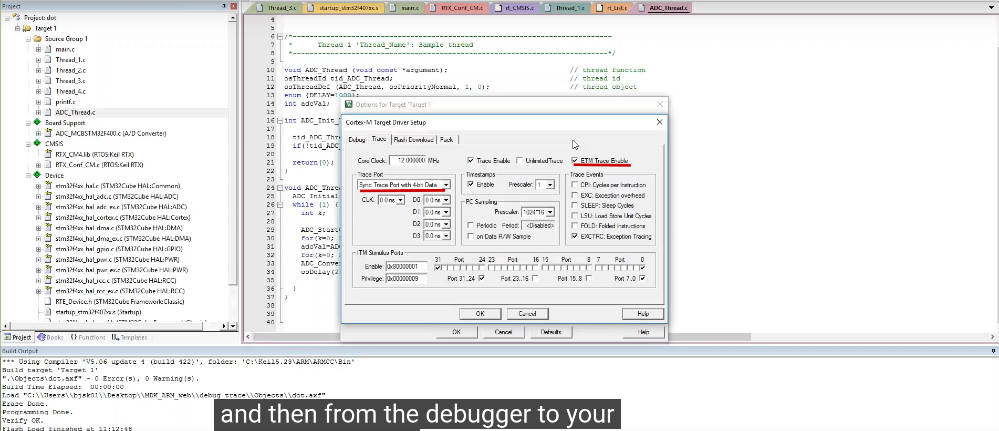

- 選擇ETM enable

- 可以看到所有assembly/c的執行時間和time_stamp

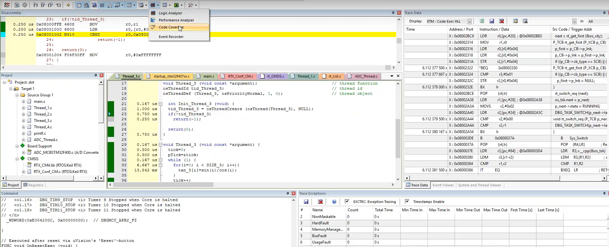

- 看所以function的coverage

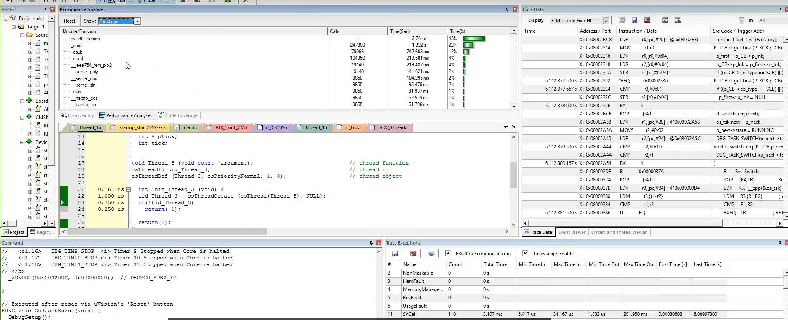

- 看所有function的佔比

## Event Recorder