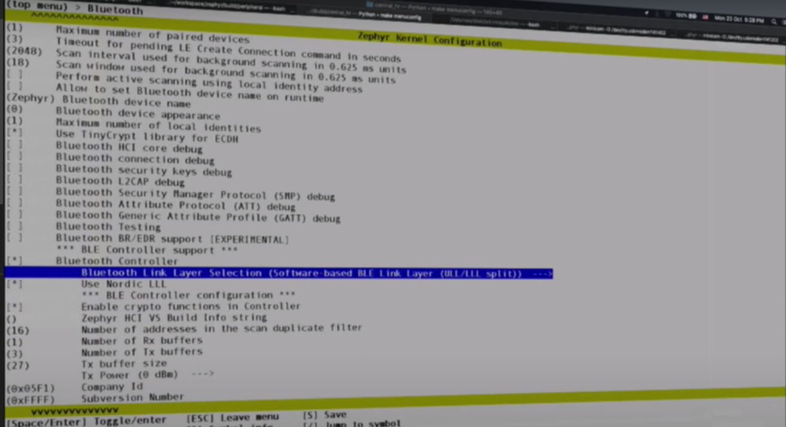
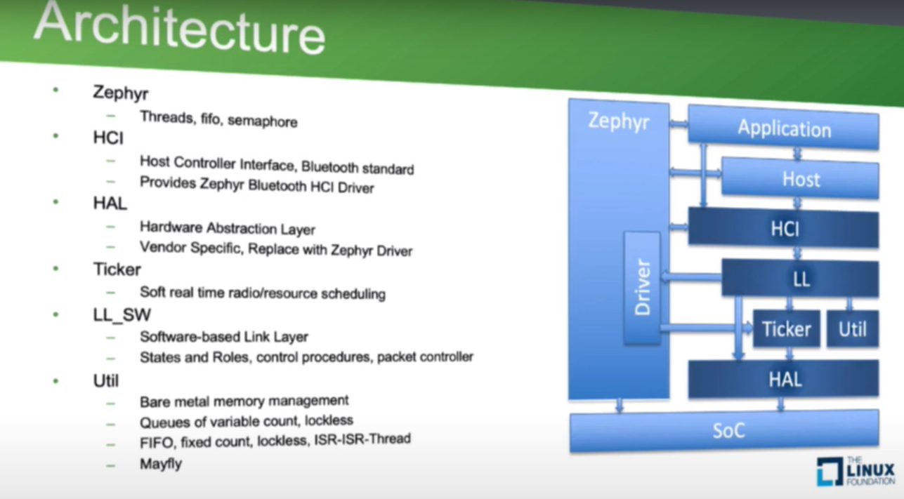
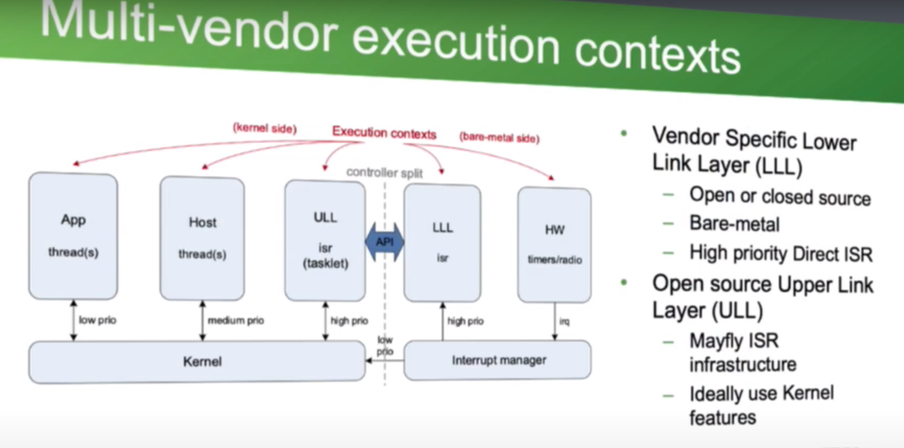
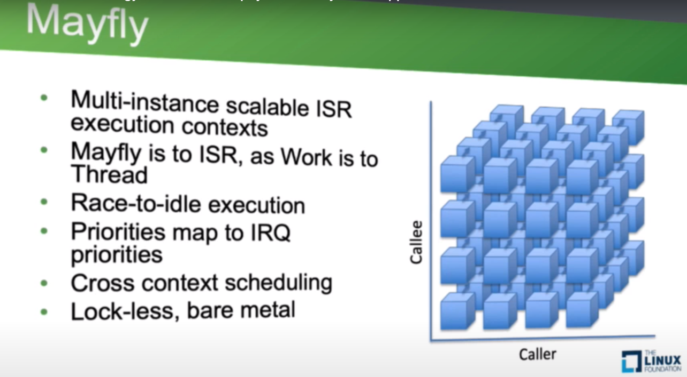
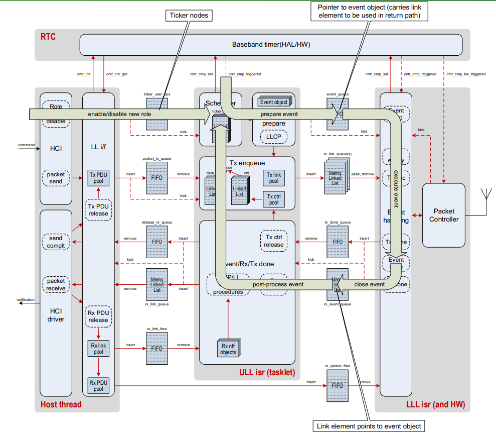
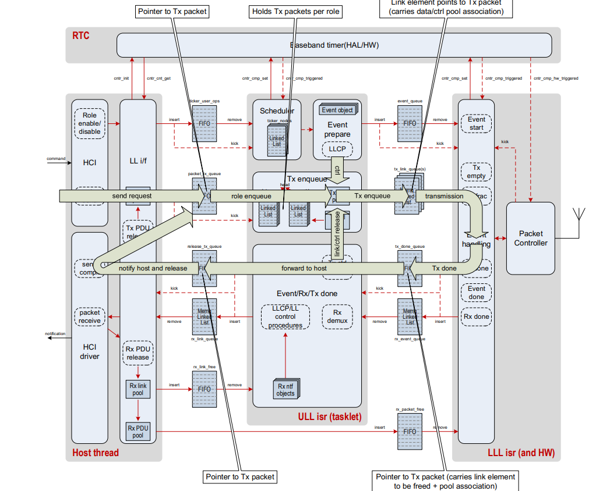
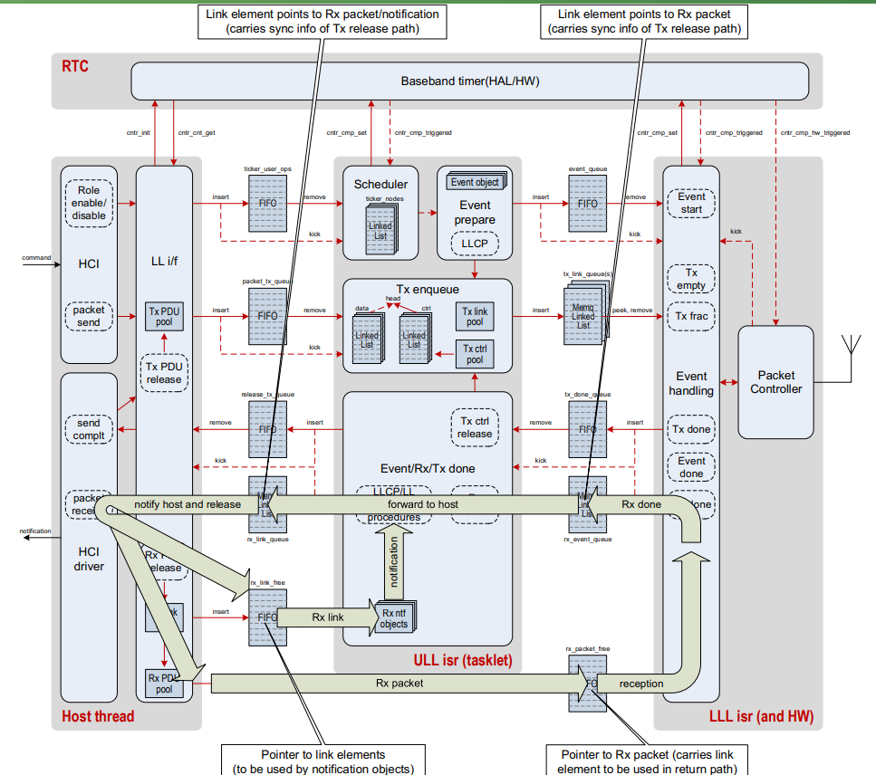

## MISC

[Zephyr_LE_controller](https://www.youtube.com/watch?v=rIicvcriWR8&t=14s)

[nrfxlib and zephyr](https://developer.nordicsemi.com/nRF_Connect_SDK/doc/latest/nrf/ug_ble_controller.html)

## Introduction

- 使用zephyr BLE SW controller
- Bluetooth Controller Debug Pins可以輸出Tx/Rx訊號
- 開放vendor能夠implement HAL 

### Architecture

- HAL: 目標是移除他; 使用native zephtr driver
- Ticker: 負責scheduling
- LL_SW: packet Tx/Tx控制
- mayfly: executing functions across interrupt inter-priorities 

- Upper Link Layer: open source and it wuold have the control procedures and share scheduling of the radio events
- Lower Link Layer: 
    - Nordic open source low link layer
- Upper/Lower Link Layer API: 

### mayfly

- scheduled by an ISR and executed in an ISR
- caller would request to schedule a function that would be scheduled it in ISR at the priority it wants to be executed
- each ISR has a queue of functions which the caller would enqueue and trigger IRQ to process those functions

Ticker and Mayfly implementation are specific to BLE controller scheduling and they are barebones implementation contributed to Zephyr Project.

Mayfly schedule functions to be run deferred in another execution context.

Currently the BLE controller uses them to call functions in interrupt contexts.

### scheduling

- HCI drive command後, 由LL if準備scheduling message並放到packet_tx_queue裡
- ULL會準備cntr_cmp_set等待trigger
- compare trigger後就會放置進pipeline
- 之後就會schedulet the preparation for radio event in LLL
- radio做完TX/RX以後, 就會有message送回給ULL通知特定event已經結束
- ULL就會再往pipeline看有沒有overlaping events可以被執行的

- TX PATH: 一樣由HCI drive LLIF去enqueue到FIFO
- packet_tx_fifo: fixed size FIFO, 和HCI read buffer size的大小相同
- 傳完後會tx_done_queue

- RX PATH