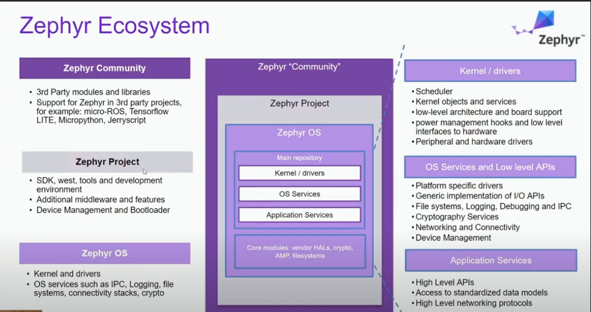
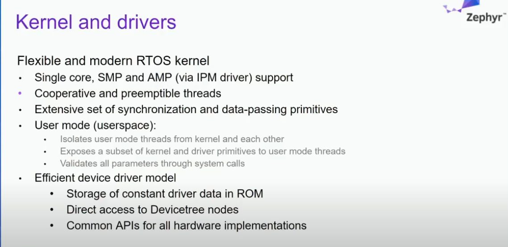
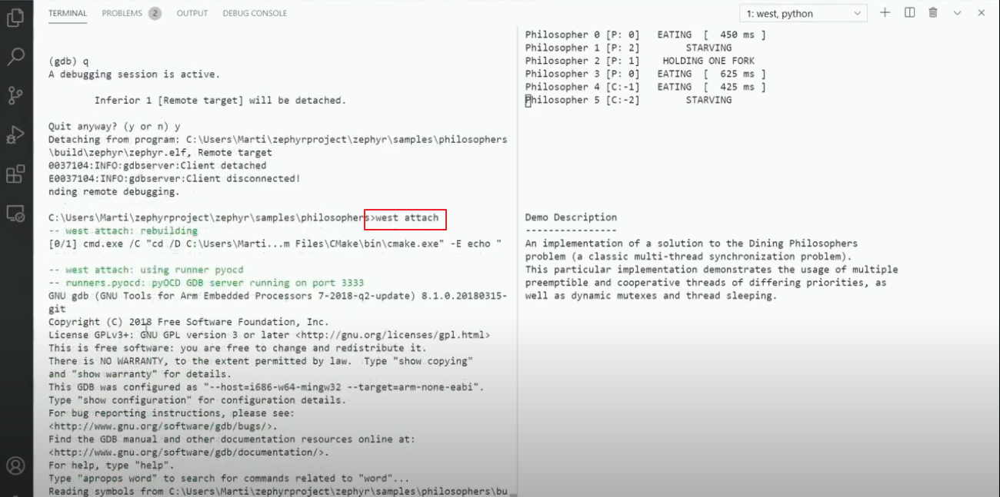

## MISC

[connect over IP](https://github.com/project-chip/connectedhomeip#connected-home-over-ip)

[ninja](https://blog.csdn.net/yujiawang/article/details/72627121)

[NCS教學](https://www.eet-china.com/mp/a34779.html )

[NCS SDK get started](https://devzone.nordicsemi.com/nordic/nrf-connect-sdk-guides/)

## Overview

### Zephyr Overview

- main 是和3rd-party比較無關的部分
- 利用west maintain repos

- Koncfig: 用python重新實作以達到cross platform
- Device Tree: 有點不同於linux中的device tree, HW都是在build time決定, 沒有run time HW detection

- 多種HCI INF的選擇

- 下一世代會區分upper/lower link layer
- le audio正在做

- 把zephyr當成Linux app的一部分去debug, 可使用linux原生的debug tool

### West Overview

- stand alone CLI app for managing workspace
- 也提供了west extension

- build in
  - 用來config和sync code from repo
- extension
  - 用來Build/flash/debug code

- west.yaml為manifest file, 決定了哪些git repo為current working repos

- modules會根據west.yaml的設定去clone相對應的git repo下來
- modules為3rd-party code

- west.yaml決定commit和path

- 可以用guiconfig去編輯Kconfig的內容

- 使用zephyr shell, 用COM12溝通並mount fs

- 使用west debug, 會重新Build並且開出gdb

- west attach, 和debug很像, 除了不會refresh anything
- 他直接drop directly into a gdb prompt which is running on the target

#### MISC

[west config](https://blog.csdn.net/bruceoxl/article/details/109139821)

#### Parameters

#mkdir build && cd build
#cmake -GNinja -DBOARD=
#ninja
3.1.2 menuconfig

 使用west：
#west build -t menuconfig
 ninja：
#ninja menuconfig
